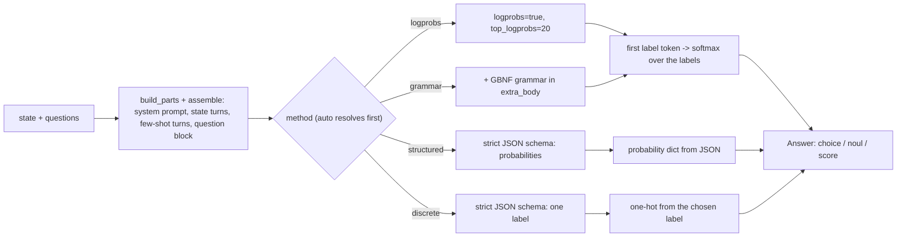

# jevper

The [Jev](https://docs.typesafe.ai) interface — `state` in, typed `questions` (`noul`, `choice`, `score`) out,
answers carrying probabilities and confidence — on top of any OpenAI-compatible model.

Same call as `typesafe-sdk`, different backend: point `jevper` at a hosted LLM or a self-hosted llama.cpp
server and code written for Jev keeps working, unchanged.

It does not call the hosted TypeSafe API and does not depend on `typesafe-sdk` or `openai` at runtime — the
client object is duck-typed. Any object exposing `responses.create` or `chat.completions.create` works,
including a self-hosted llama.cpp server.

> `jevper` is an independent implementation of the documented System One wire format. It is not affiliated
> with, endorsed by, or supported by TypeSafe AI — questions about the API itself belong in
> [their docs](https://docs.typesafe.ai).

```python
from openai import OpenAI
from jevper import Choice, SystemOneClient

client = SystemOneClient(OpenAI(), model="gpt-5.6-terra", method="logprobs")

response = client.system_one(
    state="I was charged twice for the same subscription this month.",
    questions={
        "intent": Choice(
            instructions="Pick the intent of the message.",
            criteria={
                "billing": "money, invoices, refunds, charges",
                "technical": "errors, crashes, login or performance problems",
                "sales": "pricing, plans, purchasing, upgrades",
            },
        )
    },
)

answer = response.answers["intent"]
answer.choice        # "billing"
answer.probabilities # {"billing": 0.88, "technical": 0.08, "sales": 0.03}
answer.confidence    # 0.83
```

## Install

```sh
pip install jevper
```

Python 3.10+. The only runtime dependency is `pydantic>=2.7`.

For development:

```sh
git clone https://github.com/zhulinchng/jevper && cd jevper
uv venv && uv pip install -e '.[test]'
pytest -q
```

## What one call does



Each question becomes its own provider call, so questions are independent and run concurrently
(`max_concurrency`, default 8). Answers come back keyed by your question ids, in insertion order.

## Questions

Three types, mirroring the Jev API — `Noul` answers yes/no with one probability, `Choice` picks one of your
labelled options, `Score` rates on an ordered scale:

| Type | Criteria | Answer |
| --- | --- | --- |
| `Noul(instructions=..., criteria={"true": ..., "false": ...})` | optional | `{"type": "noul", "noul": 0.93}` |
| `Choice(instructions=..., criteria={"billing": "...", ...})` | 2–255 keys | `{"type": "choice", "choice": "billing", "probabilities": {...}, "confidence": 0.83}` |
| `Score(instructions=..., criteria=["Calm", "Frustrated", "Very angry"])` | 2–10 levels | `{"type": "score", "score": 1.05, "legend": {...}, "probabilities": {...}, "confidence": 0.92}` |

`Score.score` is the probability-weighted level index (`Σ i·pᵢ`, levels zero-based), as in the Jev API.
`Choice` takes up to 255 options, the Jev API limit. The two methods that read a label *token* —
`logprobs` and `grammar` — stop at 26, because the first token of `"AA"` is `"A"`; past 26 options they
raise `InvalidQuestionError` pointing at `structured` and `discrete`, which answer in JSON and use
two-letter labels. The default `method="auto"` never hits that error: it answers a wide `Choice` in JSON.

Questions can also be passed as raw mappings (`{"type": "choice", "criteria": {...}}`) and are validated the
same way.

## Methods

`method=` decides how the decision is elicited. All four share the same label→option mapping, so switching
methods does not change your types; only the label alphabet differs (`logprobs` and `grammar` need
single-letter labels, so they cap at 26 options).

| Method | Request | Readout | Needs |
| --- | --- | --- | --- |
| `auto` (default) | `logprobs`, or `structured` where the provider cannot return logprobs | whichever method it resolved to | a provider that returns logprobs, or JSON-schema structured output |
| `logprobs` | `logprobs=true, top_logprobs=20` | softmax over the labels' logprobs of the first answer token | a provider that returns chat logprobs (or the Responses surface with `include` logprobs) |
| `grammar` | the same plus a GBNF `grammar` in `extra_body` | same as `logprobs` | a Chat Completions server that accepts `grammar` (llama.cpp and friends) |
| `structured` | strict JSON schema, model returns a probability per option | the model's own numbers, rescaled to sum 1 when off by more than `1e-6` | JSON-schema structured output |
| `discrete` | strict JSON schema, model returns one option | one-hot distribution | JSON-schema structured output |

`auto` is the default because logprobs are not universal: OpenAI's reasoning models reject them
(`logprobs are not supported with reasoning models.`), Anthropic and Gemini's OpenAI-compatibility endpoint
never had them, and a model that returns a logprob with no alternatives gives you no distribution at all.
`auto` reads the logprobs where they exist — they are one short call and the model's real distribution
rather than a self-report — and answers in JSON where they do not, remembering the verdict per model and
surface. See [docs/methods.md](https://github.com/zhulinchng/jevper/blob/main/docs/methods.md#auto) for the
provider table, the exact request bodies, the readout rules and the failure modes.

## Reasoning

Pass `reasoning=ReasoningConfig(...)` to make the model think before it classifies:

```python
from jevper import ReasoningConfig, reasoning_text

client = SystemOneClient(OpenAI(), model="gpt-5.6-terra", reasoning=ReasoningConfig(effort="medium"))

response = client.system_one(state=..., questions=...)
reasoning_text(response.reasoning)   # the trace, as text
```

`mode="auto"` (the default) uses native provider reasoning on the Responses surface and a two-step
think-then-classify path on Chat Completions, where the analysis text is replayed as an assistant turn before
the answer. The trace always lands on `response.reasoning`, and the two-step analysis call's usage is counted
in `response.usage`. See [docs/reasoning.md](https://github.com/zhulinchng/jevper/blob/main/docs/reasoning.md).

## Few-shot examples

Examples are chat turns (example state + question block, then the expected answer), so the demonstration is
always in the format the active method expects. They can be attached at three levels:

```python
from jevper import Choice, Example, SystemOneClient

question = Choice(
    criteria={"billing": "...", "technical": "..."},
    examples=[Example(state="Charged twice for one order", answer="billing")],
)

client = SystemOneClient(OpenAI(), model="gpt-5.6-terra",
                         examples=[Example(state="Login fails", answer="technical")])  # fallback for every question

client.system_one(state=..., questions={"intent": question},
                  examples={"intent": [...]})  # or a bare sequence for all questions
```

Precedence is question → per call → constructor, and the first non-empty level wins. `examples` is excluded
from `model_dump()`, so question dumps keep exactly the Jev wire keys. See
[docs/few-shot.md](https://github.com/zhulinchng/jevper/blob/main/docs/few-shot.md).

## Response

```python
response.model                 # the model actually used
response.answers               # {"intent": ChoiceAnswer(...)}
response.nouls / .choices / .scores   # filtered views
response.usage                 # input_tokens, output_tokens, reasoning_tokens, n_calls, n_retries, latency
response.reasoning             # tuple[ReasoningContentPart, ...]
response.debug                 # per-attempt requests/responses, retry reasons, normalization notes
```

`response.model_dump_json()` serializes to the Jev answer shape — the answer field names and JSON keys match
`POST /v1/systemone`. Token counts are `None` when any constituent call omitted them; `n_calls` counts the
provider calls that returned a result, including analysis passes and corrective retries, while `n_retries`
counts transient-failure retries only. A failed attempt appears in `debug["llm_attempts"]` but not in `usage`. See [docs/api.md](https://github.com/zhulinchng/jevper/blob/main/docs/api.md) for the full reference.

## Failures

Local problems fail before any request is sent: an invalid question, an empty `questions` mapping, an
unusable `state`, or `grammar` on a surface that cannot carry a grammar.

| Error | Raised when |
| --- | --- |
| `InvalidQuestionError` | question or few-shot example is locally invalid |
| `UnsupportedMethodError` | `method="grammar"` on the Responses surface |
| `ClientCapabilityError` | the client lacks the attribute the chosen surface needs, or the response carried no choices and no explanation of why |
| `LabelReadoutError` | the first answer token is not a label, or the provider returned no logprobs (or no alternatives, or no logprob for that token). The provider-side cases are not corrective-retried, and `method="auto"` answers them with `structured` |
| `MalformedAnswerError` | the JSON answer had an unusable shape after corrective retries |
| `ProviderError` | a provider call failed; `.attempts` carries the attempt history and `.status_code` the status the provider reported — including one carried inside a `200` body, which is how OpenRouter reports an upstream failure |
| `JevperError` | constructor misuse, a bad `state` message, or content that is not JSON-serializable |

Transient failures (HTTP 408/429/500/502/503/504/529, connection and timeout errors — including the `httpx`
transport errors whose class names carry neither word) are retried per call with
`RetryPolicy(n_retries=2, base_delay=0.5, max_delay=8.0)` and exponential
backoff `min(base_delay · 3ⁿ, max_delay)`. Unreadable answers get one corrective retry
(`n_retry_malformed`) with the failure appended to the conversation. `ProviderError` propagates after all
questions have settled, in question insertion order.

## Verification

```sh
pytest -q                      # the whole suite runs against a local stub HTTP server; no network, no API keys
ruff check src tests           # clean except three PYI034 hints (see docs/internals.md)
```

The suite drives a real `openai` SDK client at a stdlib `ThreadingHTTPServer` stub, so the SDK's own
serialization path is exercised; see [docs/internals.md](https://github.com/zhulinchng/jevper/blob/main/docs/internals.md#testing).

Optional live check, skipped unless both variables are set:

```sh
LLM_MODEL=gpt-5.6-terra OPENAI_API_KEY=... pytest -q tests/test_live.py
```

## Docs

- [docs/api.md](https://github.com/zhulinchng/jevper/blob/main/docs/api.md) — constructor and `system_one` parameters, answer/usage/debug shapes, errors
- [docs/methods.md](https://github.com/zhulinchng/jevper/blob/main/docs/methods.md) — the four methods, request bodies, readout rules, surface selection
- [docs/reasoning.md](https://github.com/zhulinchng/jevper/blob/main/docs/reasoning.md) — native vs two-step reasoning, traces, encrypted content
- [docs/few-shot.md](https://github.com/zhulinchng/jevper/blob/main/docs/few-shot.md) — example levels, precedence, rendering, structured examples
- [docs/internals.md](https://github.com/zhulinchng/jevper/blob/main/docs/internals.md) — module map, call flow, concurrency, retries, testing

## License

Apache-2.0 — see [LICENSE](https://github.com/zhulinchng/jevper/blob/main/LICENSE).
