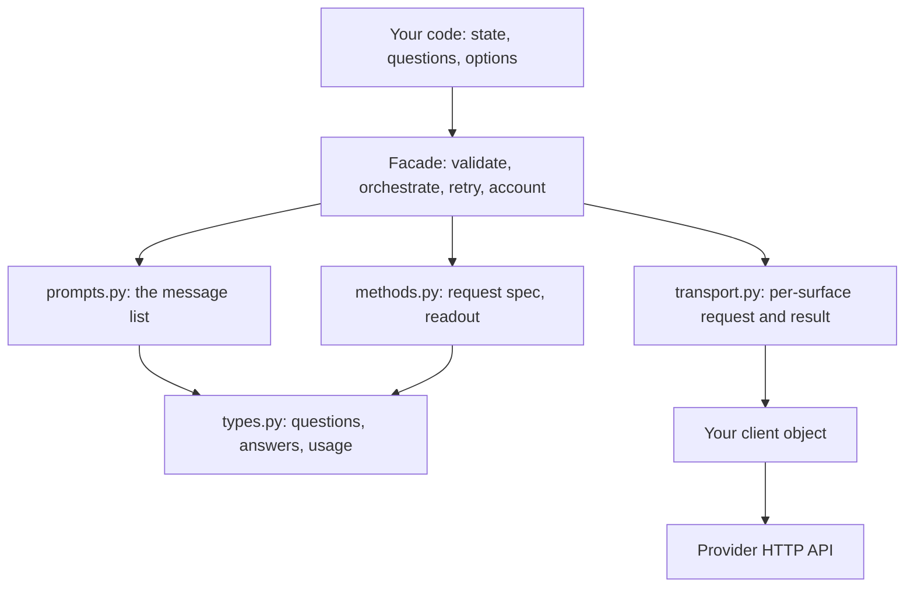
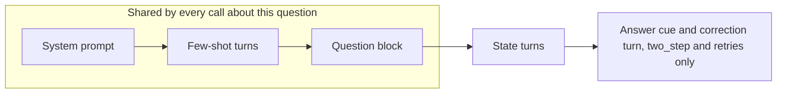
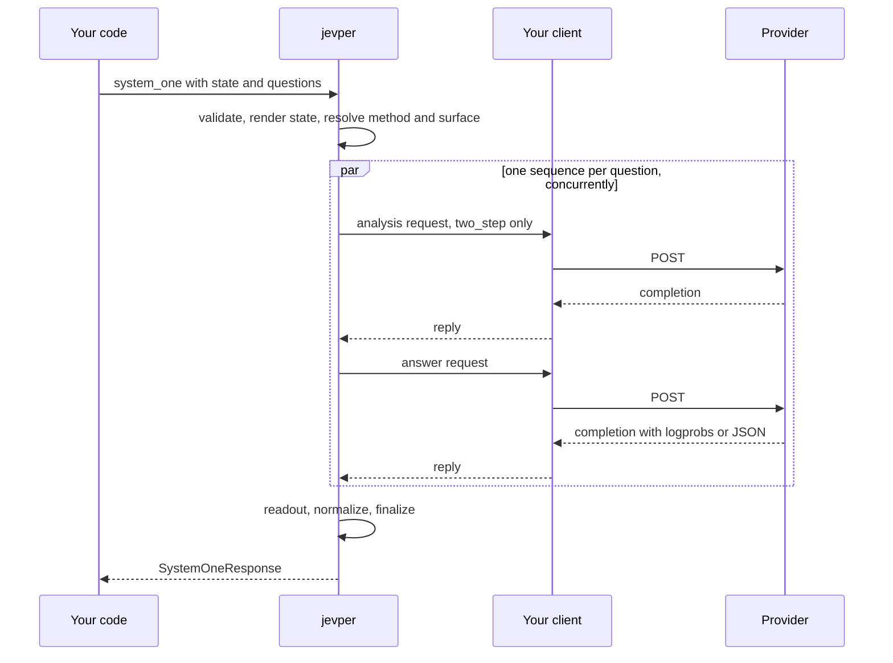
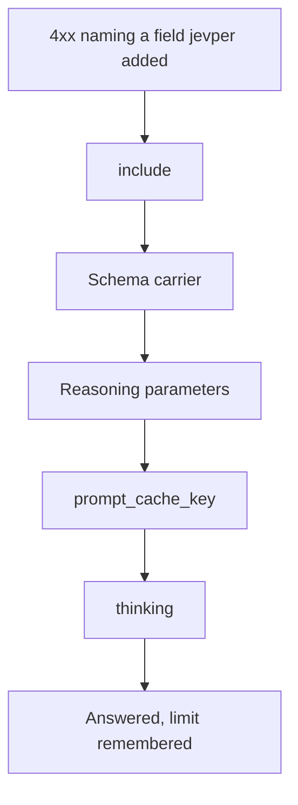

# Architecture

*Independent implementation of the documented System One wire format — not affiliated with TypeSafe.*

One call in, typed answers out. `system_one(state=..., questions=...)` validates a rubric, renders a
prompt, sends a request per pass — one normally, two in two-step mode, more when a retry or a
capability re-ask is needed — reads a distribution off the reply, and returns answers, reasoning, usage
and a debug record. This page is the map: what each layer owns, what crosses each boundary, and which
decision is made where. [Internals](internals.md) is the implementation reference behind it — the
generator mechanics, the accounting rules and the invariant list.

## The layers

The dependencies run one way: the facade drives, `prompts.py` and `methods.py` never reach a provider,
and `transport.py` is the only module that touches the client; the full import graph is in
[Internals](internals.md#module-map). No provider SDK is imported — the one runtime dependency is
`pydantic` — so a local server, a hosted API and a hand-written stub are the same code path, and the
same `SystemOneResponse` comes back from all three.

**The client contract.** jevper reads `chat.completions.create`, `responses.create` or
`messages.create` off the object you pass, as attributes, and calls it with keyword arguments. The
reply is read more loosely: any field is taken as an attribute or a mapping key, so a client may
return the SDK's typed model or a plain dict. The blocking facade needs blocking methods and the
async facade needs coroutines; handing one the other raises `ClientCapabilityError` naming the class
to use. [The complete example](complete-example.md#a-client-that-is-not-an-sdk) has a client that is
not an SDK at all.

## Two decisions, made once per call

A surface says *where* the request goes; a method says *how the decision is elicited*. They are
independent, and each is resolved before the first request.

**Surface** — the API dialect on the wire: `chat_completions`, `responses` or `messages`. With
`api="auto"` the client is asked what it exposes, in that order: `responses.create`, then
`chat.completions.create`, then `messages.create`. A pinned `api` is checked against the same three
and refused with `ClientCapabilityError` before anything is sent. `grammar` is Chat-only, so it pins
the surface itself.

**Method** — how the model is made to answer: `logprobs` reads the distribution off the first answer
token, `grammar` constrains that token to one label per option, `structured` asks for a JSON object
carrying a probability per option, and `discrete` for one option per answer. With `method="auto"` the
choice is made per `(model, surface)`: the method this client has already learned works there,
otherwise `logprobs`, and `structured` where the provider cannot supply logprobs at all. `auto` never
resolves to anything but `logprobs` or `structured` — see [Methods](methods.md#auto).

| Method | Chat Completions | Responses | Messages |
| --- | --- | --- | --- |
| `logprobs` | `logprobs` + `top_logprobs` | `include` with `message.output_text.logprobs` | refused: that API has no logprobs |
| `grammar` | GBNF `grammar` in `extra_body` | refused: no such field | refused |
| `structured` | `response_format` JSON schema | `text.format` JSON schema | `output_config.format` in `extra_body`, plus the schema in the prompt |
| `discrete` | as `structured` | as `structured` | as `structured` |

A method that needs a field the surface does not have is refused locally, never silently downgraded:
`UnsupportedMethodError` for a pinned method, one surface move for `auto` on the OpenAI surfaces, and
the structured fallback for a provider that has no logprobs to give.

## What one request contains

The state comes last because it is the only part that changes from call to call: a provider reuses a
cached prefix up to the first differing token, and with the state earlier every new state reprocessed
the whole prompt. The question block is a turn of its own, so a chat-list state stays verbatim, roles
included. The two exceptions are deliberate — a state's own `system`/`developer` turns are folded
into the leading system prompt, because the servers here reject a late instruction turn, and a state
whose final turn is the assistant's puts the question block last again, so the request still ends on
a question.

Each question's prompt is rendered once and assembled per pass, so a two-step call and a corrective
retry share the same rendered prefix. `prompt_cache_key` is derived from that prefix — model, method,
example turns and question block, never the state — unless the caller supplies one.

## The life of a call

Validation happens before the first request, so a bad rubric costs nothing. A generation the provider
itself cut short, filtered or refused raises `IncompleteAnswerError` or `ModelRefusalError` rather than
reading as a weak answer; an answer that arrived unreadable gets a correction turn, up to
`n_retry_malformed` of them, and a request the provider refused gets the ladder below. The attempt
history lands in `debug["llm_attempts"]` either way.

## When a server refuses a field

jevper adds request fields for capability — the Responses `include` list, the schema carrier, the
reasoning parameters, the cache key, the Messages `thinking` field. A refusal of a *field* is
answered by dropping it one rung and asking again, in this order, because none of them is needed to
answer:

The ladder is finite, so a server that refuses everything still ends in a `ProviderError`, and the
same call is re-asked with the request rebuilt from the limit the transport was built with. A
refusal of a *value* is not a field refusal and moves nothing: a `budget_tokens` below a server's
minimum travels back as that server's own error, and a `top_logprobs` cap below the default is
answered with a logprob-free method under `auto` — either way nothing is remembered, so the next call
tries logprobs again.

## What a client remembers

Three verdicts live on the client for its lifetime: which method works for a `(model, surface)`, which
fields that server accepts for it, and which surfaces answer `404` for a route the server does not
have — that last one remembered per surface, since a route is the server's, not the model's. They only
ever change what `auto` and `api="auto"` do; a pinned method sends byte-identical requests whatever
the client has learned. A readable distribution retires a remembered absence, so a server
that recovers is tried again, and the full record is in `debug`.

## Concurrency and accounting

Questions are independent, so each runs its own request sequence: a thread pool for the blocking
client, a semaphore for the async one, both bounded by `max_concurrency` and reused across calls.
Each worker keeps its own usage record and the results are merged in question order, so the
response is deterministic whatever order the requests finished in; the first failure in that same
order is raised after every question has settled, and no partial `answers` is returned.

`usage.n_calls` counts successful provider results — a failed attempt or a fallback probe is
recorded in `debug["llm_attempts"]`, not billed as a call. Token counts sum across the call, and a
count is `None` when any provider response omitted it, because an unreported count is not a zero.

## Extending

A new method, a new surface or a new answer type each touch one module above the transport; the
client, the prompts and the readouts stay as they are. [Internals](internals.md#extending) names the
exact symbols to add.
