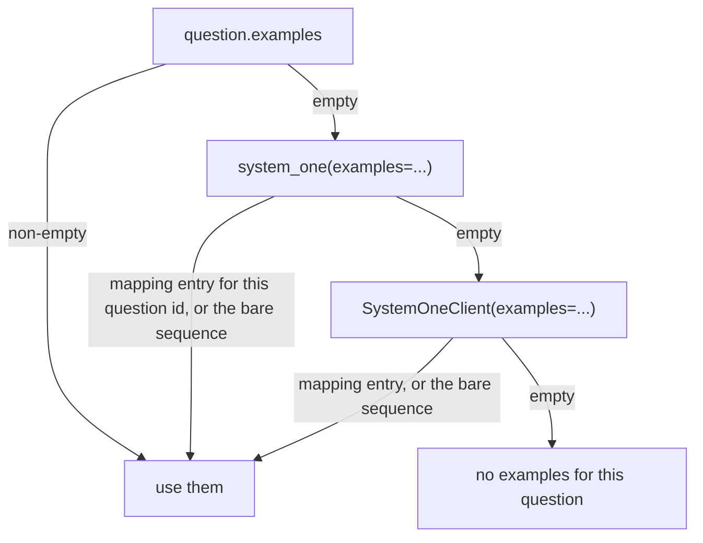

# Few-shot examples

*Independent implementation of the documented System One wire format — not affiliated with TypeSafe.*

A few-shot example is rendered as a chat turn pair: a `user` turn holding the example state plus the same
question block the real call uses, then an `assistant` turn holding the answer in the format the active method
expects. Because the demonstration goes through the same renderers as the real call, the model sees exactly the
answer shape it is being asked for — a label for `logprobs`/`grammar`, a JSON object for
`structured`/`discrete`.

```python
Example(state="Charged twice for one order", answer="billing")
Example(state="Login fails after reset", answer="technical", probabilities={"billing": 0.05, "technical": 0.9})
```

`answer` accepts a label (`"B"`, case-insensitive over ASCII — `a` is label `A`, while `ı` and `ſ` are letters
of their own and are not labels; two letters such as `"AB"` past 26 options), a `Choice` criteria key, a `Score`
level index, or a bool for `Noul`. An exact criteria key wins over a label spelled the same way, so
`answer="a"` with criteria `{"b": ..., "a": ...}` demonstrates the option keyed `a` rather than the first
label, and a non-ASCII key is matched exactly rather than case-folded. `probabilities` is rendered only by
`method="structured"` — no other answer shape carries a distribution — but it is validated for every
method, before any provider call. For `Choice` and `Score`, keys must be exactly the question's option keys
or stringified level indices, and every weight must be non-negative. For `Noul`, the mapping must name
True and/or False outcomes, also accepting `0`/`1` and lowercase `"true"`/`"false"` spellings, and every
supplied weight must be in `[0, 1]`.

## Where examples come from



The first level that yields anything wins; the levels do not merge. A mapping is keyed by question id, so
`{"intent": [...]}` applies to the `intent` question only; a bare sequence applies to every question in the
call. This makes it easy to keep a house style on the client and override it for one call or one question.

Question-level examples are validated when the `Question` model is built. Examples supplied as question
mappings or through `system_one`/`SystemOneClient` are resolved and validated during preparation, after
the question is known and before any provider call. In either path, an answer that matches no option fails
before any request:

```
InvalidQuestionError: question 'intent': example 1: answer 'nope' does not match any option of this question
```

## Rendering

For each example, in order:

| Turn | Content |
| --- | --- |
| `user` | `render_question_turn(example.state, question, labels)` — the question block, then the example state's message contents joined with `"\n\n"` |
| `assistant` | the expected answer (see below) |

The full message list for a call is normally
`[system] + example turns + [question block] + state turns`. If the state ends with an assistant turn,
jevper puts the question block last instead:
`[system] + example turns + state turns + [question block]`. In the normal order, the state comes **last**
because it is the part that changes from call to call: a provider reuses a cached prefix only up to the
first token that differs, so putting the state second — where it used to be — made every call about a new
state reprocess the whole prompt. Measured against ollama, llama.cpp, vLLM and SGLang, moving it to the end
takes the reused prefix of a 2400-token prompt from about 40 tokens to 528–1010 (see
[local-servers.md](local-servers.md#prompt-caching)). The state is never repeated.

A state that carries its own `system` or `developer` turn has that content folded into jevper's system
prompt, in the order given, and the rest of the state follows the ordering rule above. No server here accepts a
`system` turn that is not first — llama.cpp's template raises `System message must be at the beginning.` and
vLLM and SGLang answer `400` with the same words — jevper's own prompt always leads, so the alternative
would be to drop the caller's instruction or fail the call.

Expected answers per method:

| Method | Assistant turn |
| --- | --- |
| `logprobs`, `grammar` | the label, e.g. `B` |
| `structured` | `{"probabilities": {"billing": 1.0, "technical": 0.0, "sales": 0.0}}` — one-hot from `answer` when `Example.probabilities` is omitted; otherwise the supplied values, coerced to floats and emitted under the question's keys in question order |
| `discrete` | the one-hot shape that method reads: `{"choice": "B"}`, `{"noul": true}` or `{"score": 0}` |

For `Noul` in structured mode the payload is `{"noul": 1.0}` (or `{"noul": 0.0}`); supplying
`probabilities={True: 0.9}` gives `{"noul": 0.9}`, and `{False: 0.1}` gives `{"noul": 0.9}` as well. In
`discrete` mode it is `{"noul": true}` or `{"noul": false}` — that schema has no room for a weight.

Use explicit probabilities when the demonstration should teach calibration, not just format: a one-hot example
teaches the model that answers are certain.

## Wire compatibility

`examples` is declared with `Field(exclude=True)`, so it never appears in a dump:

```python
Choice(criteria={"billing": "...", "technical": "..."}, examples=[...]).model_dump()
# {"type": "choice", "instructions": None, "criteria": {"billing": "...", "technical": "..."}}
```

That keeps `model_dump_json()` on questions — and on `SystemOneResponse` — matching the Jev wire shape exactly.

## Two-step reasoning

Examples are emitted in both passes of `mode="two_step"`: the analysis call and the answer call carry the same
example turns, so the analysis reasons with the same demonstrations in view.
