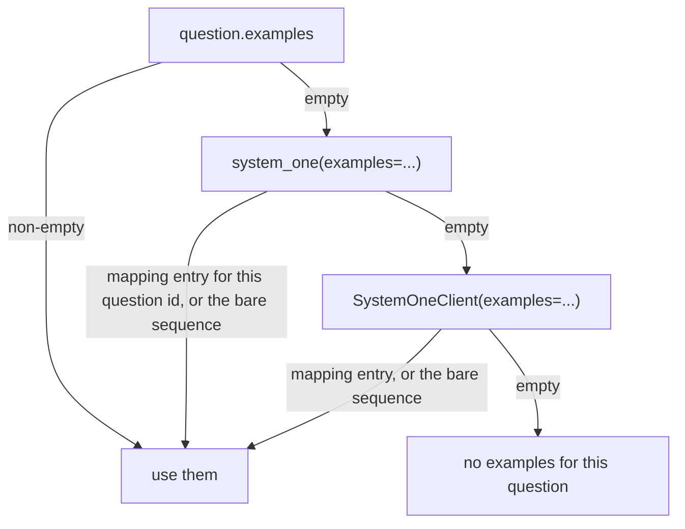

# Few-shot examples

*Independent implementation of the documented System One wire format — not affiliated with TypeSafe.*

A few-shot example is rendered as a chat turn pair: a `user` turn holding the example state plus the same
question block the real call uses, then an `assistant` turn holding the answer in the format the active method
expects. Because the demonstration goes through the same renderers as the real call, the model sees exactly the
answer shape it is being asked for — a label for `logprobs`/`grammar`/`discrete`, a JSON object for
`structured`.

```python
Example(state="Charged twice for one order", answer="billing")
Example(state="Login fails after reset", answer="technical", probabilities={"billing": 0.05, "technical": 0.9})
```

`answer` accepts a label (`"B"`, case-insensitive; two letters such as `"AB"` past 26 options), a `Choice`
criteria key, a `Score` level index, or a bool for `Noul`. `probabilities` is only read by
`method="structured"`.

## Where examples come from



The first level that yields anything wins; the levels do not merge. A mapping is keyed by question id, so
`{"intent": [...]}` applies to the `intent` question only; a bare sequence applies to every question in the
call. This makes it easy to keep a house style on the client and override it for one call or one question.

Examples are resolved and validated per question inside `system_one`, after the question is known, so an
answer that matches no option fails before any request:

```
InvalidQuestionError: question 'intent': example 1: answer 'nope' does not match any option of this question
```

## Rendering

For each example, in order:

| Turn | Content |
| --- | --- |
| `user` | `render_question_turn(example.state, question, labels)` — the example state's message contents joined with `"\n\n"`, then the question block |
| `assistant` | the expected answer (see below) |

The full message list for a call is therefore
`[system] + state turns + example turns + [question block]`: the state is never repeated in the final turn,
and a caller-supplied `system` message inside a chat-list `state` stays where it was, after jevper's own system
prompt.

Expected answers per method:

| Method | Assistant turn |
| --- | --- |
| `logprobs`, `grammar`, `discrete` | the label, e.g. `B` |
| `structured` | `{"probabilities": {"billing": 1.0, "technical": 0.0, "sales": 0.0}}` — one-hot from `answer` when `Example.probabilities` is omitted, otherwise your numbers verbatim |

For `Noul` in structured mode the payload is `{"noul": 1.0}` (or `{"noul": 0.0}`); supplying
`probabilities={True: 0.9}` gives `{"noul": 0.9}`, and `{False: 0.1}` gives `{"noul": 0.9}` as well.

Use explicit probabilities when the demonstration should teach calibration, not just format: a one-hot example
teaches the model that answers are certain.

## Wire compatibility

`examples` is declared with `Field(exclude=True)`, so it never appears in a dump:

```python
Choice(criteria={"billing": "...", "technical": "..."}, examples=[...]).model_dump()
# {"type": "choice", "instructions": None, "criteria": {"billing": "...", "technical": "..."}}
```

That keeps `model_dump_json()` on questions — and on `SystemOneResponse` — matching the Jev wire shape exactly.

## Two-step reasoning

Examples are emitted in both passes of `mode="two_step"`: the analysis call and the answer call carry the same
example turns, so the analysis reasons with the same demonstrations in view.
