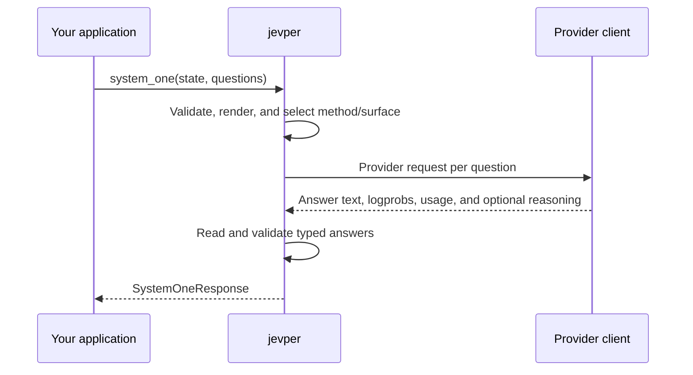

# Getting started

This guide takes you from a fresh install to one typed result. jevper is a library: it receives a caller-owned client and sends requests through that client. Credentials and provider configuration stay with you.

## 1. Install

```sh
pip install jevper
```

Use Python 3.10 or newer. For a local checkout, install the package in editable mode:

```sh
uv pip install -e .
```

The only runtime dependency is Pydantic. `openai` and `anthropic` are optional clients supplied by your application; jevper uses their public attributes without importing either SDK.

## 2. Configure a client

Use the client for your provider. This example uses the hosted OpenAI API:

```python
from openai import OpenAI

provider = OpenAI()
```

A local server uses the same OpenAI-compatible client with a different base URL:

```python
from openai import OpenAI

provider = OpenAI(
    base_url="http://127.0.0.1:11434/v1",
    api_key="local",  # the server may ignore this value
)
```

Do not put a real secret in documentation or source control. jevper does not read `.env` files or provider environment variables.

## 3. Make the first call

```python
from jevper import Choice, SystemOneClient

client = SystemOneClient(provider, model="gpt-5.6-terra")

response = client.system_one(
    state="The login page is blank after I clear my browser cache.",
    questions={
        "intent": Choice(
            instructions="Pick the intent of the message.",
            criteria={
                "technical": "an error, failure, crash, login, or performance problem",
                "billing": "an invoice, charge, refund, or payment question",
                "sales": "pricing, plans, purchasing, or an upgrade",
            },
        )
    },
)

answer = response.answers["intent"]
print(answer.choice)          # "technical"
print(answer.probabilities)  # mapping from criteria key to probability
print(answer.confidence)     # 0..1 confidence derived from the distribution
```

Every question is independent. jevper runs multiple questions concurrently, returns answers keyed by the supplied question IDs, and preserves question insertion order.

## 4. Read the result

`SystemOneResponse` contains:

- `answers` — typed `Choice`, `Noul`, and `Score` answers;
- `usage` — provider call and token accounting;
- `reasoning` — reasoning content returned by the model, when configured; and
- `debug` — resolved method and surface, attempts, retries, and server limits.

The default `method="auto"` asks for logprobs first when the selected provider surface can return them. Providers and models without a usable distribution fall back to structured output. Pin `method="logprobs"` only when you want a provider refusal to be reported instead of relying on the fallback.

## Sync or async?

Use `SystemOneClient` for blocking code:

```python
answer = client.system_one(state=text, questions=questions).answers["intent"]
```

Use `AsyncSystemOneClient` inside an async application and await `system_one`:

```python
from jevper import AsyncSystemOneClient

async_client = AsyncSystemOneClient(provider, model="gpt-5.6-terra")
response = await async_client.system_one(state=text, questions=questions)
```

The async client has the same question types, method selection, retries, and response shape. It does not own or close the provider client; call the provider client's own close method when your application shuts down.

## What happens on one call?



## Next steps

- Read [Methods](methods.md) to choose a concrete method and understand surface selection.
- Read [Local servers](local-servers.md) for Ollama, llama.cpp, vLLM, SGLang, and LM Studio settings.
- Read [API reference](api.md) for signatures, limits, errors, and response fields.
- Add [Reasoning](reasoning.md) or [Few-shot examples](few-shot.md) when the task needs them.
