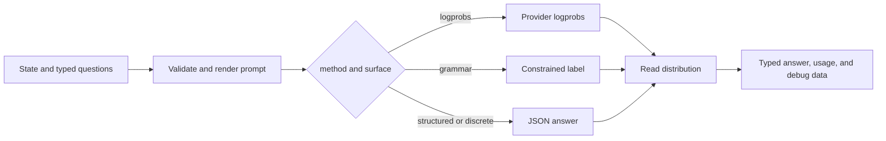

# jevper

**Typed questions for OpenAI-compatible models.** jevper turns a state string and `noul`, `choice`, or `score` questions into typed answers: `choice` and `score` answers carry probabilities and confidence, and a `noul` answer its `noul`.

jevper is an independent implementation of the documented System One wire format. It is not affiliated with, endorsed by, or supported by TypeSafe AI. The package does not call the hosted TypeSafe API and does not import an OpenAI or Anthropic SDK at runtime.

## Install

Python 3.10 or newer is required. Install the package from PyPI:

```sh
pip install jevper
```

This site documents jevper 0.7.10. `python -c "import jevper; print(jevper.__version__)"` says
which release your environment has; a different number means the site is ahead of, or behind, what
you installed.

The only runtime dependency is `pydantic>=2.7`. You provide a client object; jevper does not read credentials or provider configuration from the environment.

## First call

```python
from openai import OpenAI
from jevper import Choice, SystemOneClient

client = SystemOneClient(OpenAI(), model="gpt-5.6-terra")

response = client.system_one(
    state="I was charged twice for the same subscription this month.",
    questions={
        "intent": Choice(
            instructions="Pick the intent of the message.",
            criteria={
                "billing": "money, invoices, refunds, charges",
                "technical": "errors, crashes, login or performance problems",
                "sales": "pricing, plans, purchasing, upgrades",
            },
        )
    },
)

answer = response.answers["intent"]
print(answer.choice, answer.probabilities, answer.confidence)
```

`method="auto"` is the default: jevper uses logprobs when the provider returns a usable distribution and falls back to structured output when it does not. The method, surface, retries, and per-question usage are available in `response.debug` and `response.usage`.

## Choose a page

| I want to… | Read |
| --- | --- |
| Install jevper and make the first sync or async call | [Getting started](getting-started.md) |
| See every public option set at once, with a program that runs | [Complete example](complete-example.md) |
| Understand how a call is built, and what each layer owns | [Architecture](architecture.md) |
| Choose `logprobs`, `grammar`, `structured`, or `discrete` | [Methods](methods.md) |
| Configure a local OpenAI-compatible server | [Local servers](local-servers.md) |
| Run decisions locally against [Ollaya](local-servers.md#ollaya-the-decision-server), including its native endpoint | [Local servers](local-servers.md#ollaya-the-decision-server) |
| Inspect the complete public API and error contract | [API reference](api.md) |
| Add native or two-step reasoning | [Reasoning](reasoning.md) |
| Provide demonstrations to the model | [Few-shot examples](few-shot.md) |
| Understand call flow, concurrency, retries, and tests | [Internals](internals.md) |
| Trace calls or host jevper with MLflow | [MLflow](mlflow.md) |
| Work out why a call failed and what to change | [Troubleshooting](troubleshooting.md) |
| Look up what a term in the docs means | [Glossary](glossary.md)

## How a call is selected



Start with [Getting started](getting-started.md) for the smallest working path, then use [Methods](methods.md) and [Local servers](local-servers.md) to tune the provider surface.
