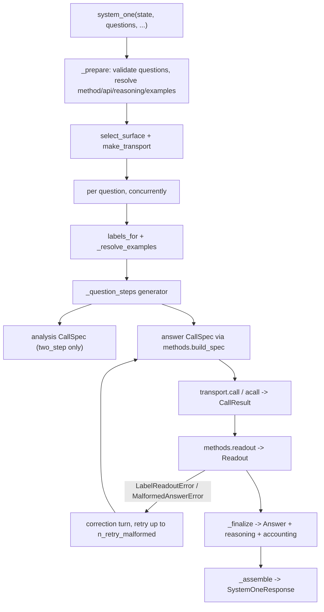

# Internals

*Independent implementation of the documented System One wire format — not affiliated with TypeSafe.*

## Module map

| Module | Responsibility |
| --- | --- |
| `errors.py` | The exception hierarchy; `ProviderError.attempts` carries the attempt records |
| `types.py` | Wire-shaped Pydantic models: questions, answers, `Usage`, `SystemOneResponse`, question validation |
| `labels.py` | `A`–`Z` allocation, the 26-option cap, label → answer-key mapping |
| `reasoning.py` | Reasoning config and content types, `reasoning_text`, mode resolution |
| `prompts.py` | Message rendering: state turns, question blocks, few-shot turns, correction messages |
| `transport.py` | The two surfaces: request builders, response normalizers, surface selection |
| `methods.py` | The four elicitation methods: request spec, schemas, grammar, readout |
| `normalize.py` | Confidence and probability arithmetic (the reference adapter's formulas) |
| `client.py` | Sync/async facades: orchestration, concurrency, retries, finalization, `debug` |
| `__init__.py` | Public re-exports and `__version__` |

The dependency direction is one-way: `client → {methods, prompts, transport, types, normalize, labels,
reasoning}` and `types → {errors, labels, reasoning}`. `labels.py` deliberately never imports `types.py` at
runtime (it is duck-typed on `question.type`) so the graph stays acyclic.

## Call flow



`_prepare` validates the questions, renders the state once for validation (discarding the result), resolves
method, surface, reasoning mode and examples, and builds the transport. It runs before any provider call, so a
bad question, an empty `questions` mapping, an unusable `state` or `grammar` on the Responses surface produces
zero HTTP requests.

## The per-question generator

The sequence "analysis pass → answer pass → corrective retries" is written once, in `_question_steps`, as a
generator that yields a `CallSpec` and receives a `CallResult` back:

```python
steps = self._question_steps(...)
spec = next(steps)
while True:
    spec = steps.send(self._call(log, question_id, spec, context))
```

`StopIteration.value` is the finished `_QuestionOutcome`. The sync and async clients differ only in their
driver (`_call` uses the sync or async transport), which keeps the two implementations from drifting.

## Concurrency

- One provider call sequence per question; questions are independent.
- A single question runs inline, without touching the thread pool.
- Multiple questions run on a lazily created `ThreadPoolExecutor(max_workers=max_concurrency)` that is reused
  across `system_one` calls and shut down by `close()`. The async client uses
  `asyncio.Semaphore(max_concurrency)` and `asyncio.gather(..., return_exceptions=True)`.
- Each worker owns its own `_CallLog`, so accounting needs no locks; `_assemble` merges outcomes in question
  insertion order.
- Failures are collected and the first one in question insertion order is re-raised after every task has
  settled — one bad question cannot leave dangling threads, and `answers` is never partially returned.

## Retries

| Kind | Trigger | Counted in |
| --- | --- | --- |
| Transient | `status_code` in `{429, 500, 502, 503, 504, 529}` or a class name containing `Connection`/`Timeout` | `usage.n_retries`, with delays `min(base_delay · 3ⁿ, max_delay)` |
| Corrective | `LabelReadoutError` or `MalformedAnswerError` on the answer call | `usage.n_calls` (each is a provider call) and `debug["retry_reasons"]` |

Transient retries wrap the failing call; a non-transient error, or a transient one with the retries exhausted,
becomes a `ProviderError` with the attempt history attached. Corrective retries append a correction turn to the
answer conversation — after the `ANSWER_CUE` turn in two-step mode — and use the JSON wording for
`structured`/`discrete`, the label wording otherwise.

## Accounting

`Usage` counts are summed across every call of the request, and a count is `None` when any constituent call
omitted it (a reported `0` is preserved). `_CallLog.add_result` implements exactly that rule.

`debug` is assembled once, in `_assemble`, with all eight keys always present:

| Key | Filled by |
| --- | --- |
| `method`, `api`, `reasoning_mode` | `_CallContext` (the resolved values, not the requested ones) |
| `llm_attempts` | One record per provider call, including failed ones; the last record for a question carries its `readout` |
| `retry_reasons` | Corrective retries, in order |
| `probability_errors`, `original_probabilities` | `structured` normalization only |
| `labels_missing` | Labels the provider reported no logprob for |

## Invariants

Worth keeping when editing:

- No request ever carries `max_tokens`, `max_completion_tokens` or `max_output_tokens`. Reasoning tokens count
  against those caps, and a small cap truncates a reasoning model.
- Options are labelled with single letters only. Multi-letter labels break first-token logprob readout, so the
  26-option cap is shared by all four methods and `InvalidQuestionError` names it and says to split the
  question.
- `examples` never reaches the wire: `Field(exclude=True)` keeps question dumps and `SystemOneResponse` dumps
  at the Jev shape.
- The caller's state turns are preserved verbatim and the question block is the final turn; the state is never
  repeated.
- The provider client is never closed by jevper. `close()` shuts down the thread pool only, and
  `AsyncSystemOneClient.aclose()` is a no-op.
- Readouts raise `LabelReadoutError`/`MalformedAnswerError` for recoverable shapes and never guess; the client
  decides whether to retry.
- Probability normalization never raises: out-of-tolerance distributions are recorded in `debug` and either
  rescaled (default) or passed through.

## Extending

- **A new method**: add the `Literal` member in `types.Method`, a `build_spec` branch and a `readout_*`
  function in `methods.py`, and route it in `methods.readout`. The client needs no change — it already passes
  the method through.
- **A new surface**: add a builder and a normalizer in `transport.py`, a `Transport` subclass, and a branch in
  `select_surface`/`make_transport`. Everything above the transport is surface-agnostic.
- **A new answer type**: extend the `Answer` discriminated union in `types.py` and `_finalize` in `client.py`.

## Testing

`tests/fakes.py` runs a stdlib `ThreadingHTTPServer` on `127.0.0.1:0` that records every request body and
answers with a scripted body — either a fixed `(status, body)` pair or a callable taking the request body, so
a test can vary the response per call (used for corrective retries and multi-question runs). Tests point a
real `openai.OpenAI` / `AsyncOpenAI` at it with `max_retries=0`, so the SDK's own serialization and parsing
paths are exercised, and wrapper retry assertions measure jevper's retries rather than the SDK's. The stub
bodies carry every field the `openai` models require, including `usage.*_tokens_details`.

The suite runs offline. `tests/test_live.py` is skipped unless both `LLM_MODEL` and `OPENAI_API_KEY`
are set, and then runs one `choice` question with `method="structured"` and one with `method="logprobs"`
against the real endpoint.

Several tests pin exact numeric literals (softmax results, confidences, scores) that were computed from the
reference adapter's formulas. They are intentional: do not "recompute" them from the implementation, since a
changed literal means changed arithmetic.

Lint note: `ruff check src tests` reports three `PYI034` hints on `__enter__`/`__aenter__`. They return the
concrete class name instead of `typing_extensions.Self` on purpose — `typing_extensions` is not a declared
dependency, and `typing.Self` requires Python 3.11 while the package supports 3.10. Do not "fix" them by adding
the import.
