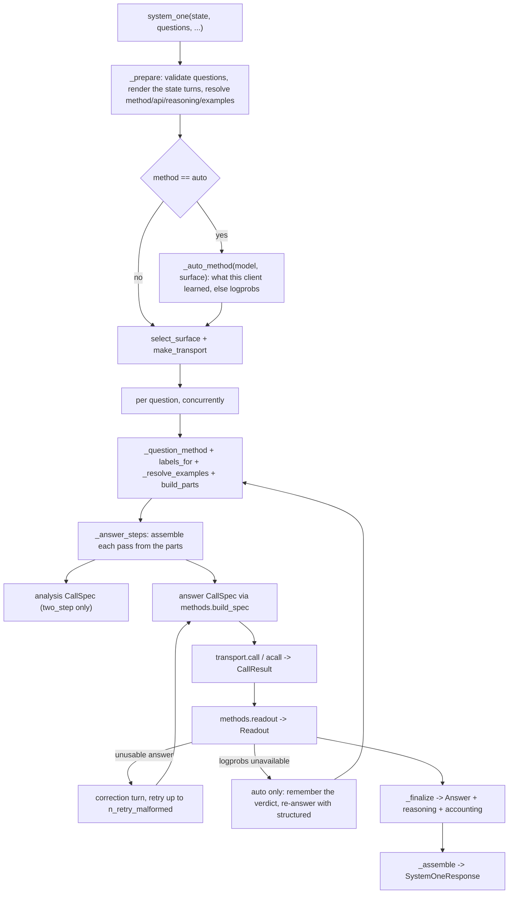

# Internals

*Independent implementation of the documented System One wire format — not affiliated with TypeSafe.*

## Module map

| Module | Responsibility |
| --- | --- |
| `errors.py` | The exception hierarchy; `ProviderError.attempts` carries the attempt records |
| `types.py` | Wire-shaped Pydantic models: questions, answers, `Usage`, `SystemOneResponse`, question validation |
| `labels.py` | Label allocation (`A`–`Z`, then `AA`–`ZZ`) and label → answer-key mapping |
| `reasoning.py` | Reasoning config and content types, `reasoning_text`, mode resolution |
| `prompts.py` | Message rendering: state turns, question blocks, few-shot turns, correction messages |
| `transport.py` | The two surfaces: request builders, response normalizers, surface selection |
| `methods.py` | The four elicitation methods: request spec, schemas, grammar, readout |
| `normalize.py` | Confidence and probability arithmetic (the reference adapter's formulas) |
| `client.py` | Sync/async facades: orchestration, concurrency, retries, finalization, `debug` |
| `__init__.py` | Public re-exports and `__version__` |

The dependency direction is one-way: `client → {methods, prompts, transport, types, normalize, labels,
reasoning}`, `types → {errors, labels, reasoning}` and `labels → errors`. `labels.py` deliberately never
imports `types.py` at runtime (it is duck-typed on `question.type`) so the graph stays acyclic.

## Call flow



`_prepare` validates the questions, renders the state turns once into `_CallContext.state_messages` (every
question reuses them), resolves method, surface, reasoning mode and examples, and builds the transport. It runs
before any provider call, so a bad question, an empty `questions` mapping, an unusable `state` or `grammar` on
the Responses surface produces zero HTTP requests.

`method="auto"` is resolved there too: `_auto_method(model, surface)` returns what this client has learned
about that provider, or `logprobs` when it has learned nothing. The verdict lives in
`_BaseClient._auto_methods`, keyed by `(model, surface)` under a lock, so a second `system_one` call on the
same client skips the discovery entirely. The surface is picked for `logprobs` rather than for the resolved
method, because the fallback method runs on either surface.

## The per-question generator

The sequence "analysis pass → answer pass → corrective retries" is written once, in `_answer_steps`, as a
generator that yields a `CallSpec` and receives a `CallResult` back:

```python
steps = self._question_steps(...)
spec = next(steps)
while True:
    try:
        result = self._call(log, question_id, spec, context)
    except _LogprobsUnavailable as exc:
        spec = steps.throw(exc)  # the generator owns the fallback decision
    else:
        spec = steps.send(result)
```

`StopIteration.value` is the finished `_QuestionOutcome`. The sync and async clients differ only in their
driver (`_call` uses the sync or async transport), which keeps the two implementations from drifting.

`_question_steps` is a thin wrapper over `_answer_steps` that exists for one reason: the provider's verdict
arrives in the driver, not inside the generator, so it is thrown back in (`steps.throw`). Under
`method="auto"` the wrapper records the verdict, switches `_CallContext.method` to `structured` — so questions
that have not started yet take the fallback for free — and re-enters `_answer_steps`, which re-renders the
prompt because `structured` uses a different system prompt and different example turns. One fallback per
question, enforced by a local flag; a pinned method re-raises instead.

`_answer_steps` renders a question's prompt once, as `prompts.PromptParts` (`build_parts`), and every pass is
assembled from those parts (`assemble`). The two-step analysis and answer calls therefore share the rendered
state turns, example turns and question block instead of re-rendering them; the state itself is rendered once
per `system_one` call, in `_prepare`. The method it uses comes from `_question_method`, which is
`_CallContext.method` unless `auto` needs a JSON method for a `Choice` past the 26-label alphabet.

## Concurrency

- One provider call sequence per question; questions are independent.
- A single question runs inline, without touching the thread pool.
- Multiple questions run on a lazily created `ThreadPoolExecutor(max_workers=max_concurrency)` that is reused
  across `system_one` calls and shut down by `close()`. The async client uses
  `asyncio.Semaphore(max_concurrency)` and `asyncio.gather(..., return_exceptions=True)`.
- Each worker owns its own `_CallLog`, so accounting needs no locks; `_assemble` merges outcomes in question
  insertion order.
- Failures are collected and the first one in question insertion order is re-raised after every task has
  settled — one bad question cannot leave dangling threads, and `answers` is never partially returned.

## Performance

The library is I/O-bound: one provider call costs hundreds of milliseconds, while the local work around it —
rendering, request building, readout, normalization — is well under a millisecond per question.

Measured on an 8-question `choice` call with a 45 KiB JSON state (CPython 3.14, M-series, best of 7):

| Method | Renders of the state | Local CPU |
| --- | --- | --- |
| `logprobs` | 1 (was 9) | 0.5 ms (was 1.5 ms) |
| `logprobs` + `two_step` | 1 (was 17) | 0.7 ms (was 2.4 ms) |
| `discrete` | 1 (was 9) | 0.5 ms (was 1.3 ms) |

So the whole local path is under 0.2 % of the wall time of a single provider call. That is why there is no
native extension (PyO3, `orjson`, `msgspec`): it would trade the universal `py3-none-any` wheel, a build
toolchain and maturin CI for a fraction of a fraction of a percent. Optimize the prompt and the request count,
not the Python.

## Retries

| Kind | Trigger | Counted in |
| --- | --- | --- |
| Transient | `status_code` in `{408, 429, 500, 502, 503, 504, 529}` (read from the exception or from `exc.response.status_code`), or `Connection`/`Timeout` in the name of the exception class or any base class, or an `httpx`-family `TransportError`/`TimeoutException` in the MRO | `usage.n_retries`, with delays `min(base_delay · 3ⁿ, max_delay)` |
| Corrective | `LabelReadoutError` or `MalformedAnswerError` on the answer call | `usage.n_calls` (each is a provider call) and `debug["retry_reasons"]` |

Transient retries wrap the failing call; a non-transient error, or a transient one with the retries exhausted,
becomes a `ProviderError` with the attempt history attached. A `200` whose body carries the provider's own
`error` object — OpenRouter reports an overloaded upstream that way, with no `choices` at all — is read as that
failure rather than as an unreadable surface, and the status inside the body decides whether it is retried.
Corrective retries append a correction turn to the answer conversation — after the `ANSWER_CUE` turn in
two-step mode — and use the JSON wording for `structured`/`discrete`, the label wording otherwise.

## Accounting

`Usage` counts are summed across every call of the request, and a count is `None` when any constituent call
omitted it (a reported `0` is preserved). `_CallLog.add_result` implements exactly that rule.

`debug` is assembled once, in `_assemble`, with all eight keys always present:

| Key | Filled by |
| --- | --- |
| `method`, `api`, `reasoning_mode` | `_CallContext` (the resolved values, not the requested ones) |
| `llm_attempts` | One record per provider call, including failed ones; the last record for a question carries its `readout` |
| `retry_reasons` | Corrective retries and method fallbacks, in order |
| `probability_errors`, `original_probabilities` | `structured` normalization only |
| `labels_missing` | Labels the provider reported no logprob for |

A ninth key, `methods` (`{question_id: method}`), is added only for `method="auto"`, where the method is a
decision per question rather than a pinned fact. Every other key is present either way, which is what keeps a
pinned method's `debug` byte-identical across releases.

## Invariants

Worth keeping when editing:

- No request ever carries `max_tokens`, `max_completion_tokens` or `max_output_tokens`. Reasoning tokens count
  against those caps, and a small cap truncates a reasoning model.
- The builders emit only the fields the surface understands; anything else the provider accepts goes through
  `extra_body` (`grammar` is merged into it), never into `CallSpec`.
- Labels are single letters up to 26 options, two letters above that. Only `structured` and `discrete` may use
  the two-letter range: multi-letter labels break first-token logprob readout, so `logprobs`/`grammar` raise
  `InvalidQuestionError` past 26 options (`methods.require_label_readout`), and `Choice` itself stops at the Jev
  API limit of 255.
- `examples` never reaches the wire: `Field(exclude=True)` keeps question dumps and `SystemOneResponse` dumps
  at the Jev shape.
- The caller's state turns are preserved verbatim and the question block is the final turn; the state is never
  repeated.
- The provider client is never closed by jevper. `close()` shuts down the thread pool only, and
  `AsyncSystemOneClient.aclose()` is a no-op.
- Readouts raise `LabelReadoutError`/`MalformedAnswerError` for recoverable shapes and never guess; the client
  decides whether to retry. A number the provider did not report stays missing (`TokenLogprob.logprob` is
  `float | None`) rather than defaulting to `0.0`, which would read as certainty, and a non-finite logprob
  raises instead of propagating a `nan` distribution into `confidence` and `score`.
- An empty assistant turn is never sent. Two-step analysis output that is blank falls back to the call's
  reasoning text, and if there is none the answer call goes from the question block straight to the cue.
- Content is rendered with `allow_nan=False`: `NaN`/`Infinity` are not valid JSON, so they raise `JevperError`
  instead of putting an unparseable prompt or example in front of the model.
- Probability normalization never raises: out-of-tolerance distributions are recorded in `debug` and either
  rescaled (default) or passed through.
- `method="auto"` never changes what a pinned method does. It resolves to a concrete method before any spec is
  built, so a provider that returns logprobs sees byte-identical requests whether the method was pinned or
  resolved, and a pinned `logprobs` call still raises `ProviderError` on a rejection.
- Only evidence about the provider is remembered. A response with no logprobs, a response whose only logprob
  is the sampled token, and a 4xx that *refuses the field* — naming it in the message, `param` or `code`
  alongside an unsupported/unknown signal — are all `_LogprobsUnavailable(capability=True)` and are cached per
  `(model, surface)`. A 4xx that only complains about the value it was sent (a server whose `top_logprobs` cap
  is below the default) and a 5xx that survived the retries are `capability=False` and are *not* cached: the
  question is answered with a logprob-free method, but the next call tries logprobs again.
- Capability failures are not corrective-retried: a correction turn changes the prompt, not what the provider
  reports. Only the model-side failures (a non-label token, an unusable JSON shape) are worth another call.
- A logprob readout needs at least two candidates. `top_logprobs` with nothing but the sampled token is not a
  distribution, so it raises instead of reporting the answer as certain; a provider that reports entries but
  nulls for some of them is the documented partial case and keeps `labels_missing` semantics.

## Extending

- **A new method**: add the `Literal` member in `types.Method`, a `build_spec` branch and a `readout_*`
  function in `methods.py`, and route it in `methods.readout`. The client needs no change — it already passes
  the method through.
- **A new surface**: add a builder and a normalizer in `transport.py`, one entry in the `SURFACES` registry, and
  a branch in `select_surface`. Everything above the transport is surface-agnostic.
- **A new answer type**: extend the `Answer` discriminated union in `types.py` and `_finalize` in `client.py`.

## Testing

`tests/fakes.py` runs a stdlib `ThreadingHTTPServer` on `127.0.0.1:0` that records every request body and
answers with a scripted body — either a fixed `(status, body)` pair or a callable taking the request body, so
a test can vary the response per call (used for corrective retries and multi-question runs). Tests point a
real `openai.OpenAI` / `AsyncOpenAI` at it with `max_retries=0`, so the SDK's own serialization and parsing
paths are exercised, and wrapper retry assertions measure jevper's retries rather than the SDK's. The stub
bodies carry every field the `openai` models require, including `usage.*_tokens_details`.

The suite runs offline. `tests/test_live.py` is skipped unless both `LLM_MODEL` and `OPENAI_API_KEY`
are set, and then runs one `choice` question with `method="structured"` and one with `method="logprobs"`
against the real endpoint.

Several tests pin exact numeric literals (softmax results, confidences, scores) that were computed from the
reference adapter's formulas. They are intentional: do not "recompute" them from the implementation, since a
changed literal means changed arithmetic.

Lint note: `ruff check src tests` reports three `PYI034` hints on `__enter__`/`__aenter__`. They return the
concrete class name instead of `typing_extensions.Self` on purpose — `typing_extensions` is not a declared
dependency, and `typing.Self` requires Python 3.11 while the package supports 3.10. Do not "fix" them by adding
the import.
