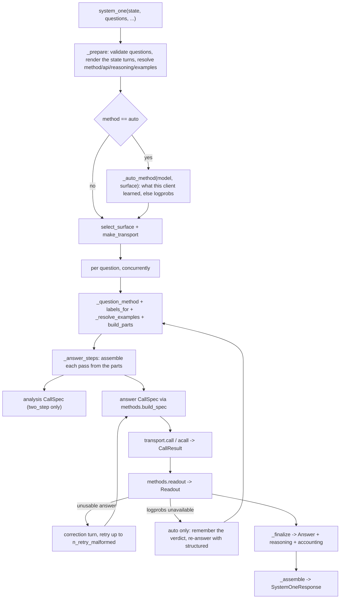

# Internals

*Independent implementation of the documented System One wire format — not affiliated with TypeSafe.*

## Module map

| Module | Responsibility |
| --- | --- |
| `errors.py` | The exception hierarchy; `ProviderError.attempts` carries the attempt records |
| `types.py` | Wire-shaped Pydantic models: questions, answers, `Usage`, `SystemOneResponse`, question validation |
| `labels.py` | Label allocation (`A`–`Z`, then `AA`–`ZZ`) and label → answer-key mapping |
| `reasoning.py` | Reasoning config and content types, `reasoning_text`, mode resolution |
| `prompts.py` | Message rendering: state turns, question blocks, few-shot turns, correction messages |
| `transport.py` | The three surfaces (`chat_completions`, `responses`, and `messages`): request builders, response normalizers, surface selection |
| `methods.py` | The four elicitation methods: request spec, schemas, grammar, readout |
| `normalize.py` | Confidence and probability arithmetic (the reference adapter's formulas) |
| `client.py` | Sync/async facades: orchestration, concurrency, retries, finalization, `debug` |
| `__init__.py` | Public re-exports and `__version__` |

The dependency direction is one-way: `client → {methods, prompts, transport, types, normalize, labels,
reasoning}`, `types → {errors, labels, reasoning}` and `labels → errors`. `labels.py` deliberately never
imports `types.py` at runtime (it is duck-typed on `question.type`) so the graph stays acyclic.

## Call flow



`_prepare` validates the questions, renders the state turns once into `_CallContext.state_messages` (every
question reuses them), resolves method, surface, reasoning mode and examples, and builds the transport. It runs
before any provider call, so a bad question, an empty `questions` mapping, an unusable `state` or `grammar` on
the Responses surface produces zero HTTP requests.

`method="auto"` is resolved there too: `_auto_method(model, surface)` returns what this client has learned
about that provider, or `logprobs` when it has learned nothing. The verdict lives in
`_BaseClient._auto_methods`, keyed by `(model, surface)` under a lock, so a second `system_one` call on the
same client skips the discovery entirely. The surface is picked for `logprobs` rather than for the resolved
method, because the fallback method runs on either surface.

## The per-question generator

The sequence "analysis pass → answer pass → corrective retries" is written once, in `_answer_steps`, as a
generator that yields a `CallSpec` and receives a `CallResult` back:

```python
steps = self._question_steps(...)
spec = next(steps)
while True:
    try:
        result = self._call(log, question_id, spec, context)
    except _LogprobsUnavailable as exc:
        spec = steps.throw(exc)  # the generator owns the fallback decision
    else:
        spec = steps.send(result)
```

`StopIteration.value` is the finished `_QuestionOutcome`. The sync and async clients differ only in their
driver (`_call` uses the sync or async transport), which keeps the two implementations from drifting.

`_question_steps` is a thin wrapper over `_answer_steps` that exists for one reason: the provider's verdict
arrives in the driver, not inside the generator, so it is thrown back in (`steps.throw`). Under
`method="auto"` the wrapper records the verdict, switches `_CallContext.method` to `structured` — so questions
that have not started yet take the fallback for free — and re-enters `_answer_steps`, which re-renders the
prompt because `structured` uses a different system prompt and different example turns. One fallback per
question, enforced by a local flag; a pinned method re-raises instead.

`_answer_steps` renders a question's prompt once, as `prompts.PromptParts` (`build_parts`), and every pass is
assembled from those parts (`assemble`). The two-step analysis and answer calls therefore share the rendered
state turns, example turns and question block instead of re-rendering them; the state itself is rendered once
per `system_one` call, in `_prepare`. The method it uses comes from `_question_method`, which is
`_CallContext.method` unless `auto` needs a JSON method for a `Choice` past the 26-label alphabet.

## Concurrency

- One provider call sequence per question; questions are independent.
- A single question runs inline, without touching the thread pool.
- Multiple questions run on a lazily created `ThreadPoolExecutor(max_workers=max_concurrency)` that is reused
  across `system_one` calls and shut down by `close()`. The async client uses
  `asyncio.Semaphore(max_concurrency)` and `asyncio.gather(..., return_exceptions=True)`.
- Each worker owns its own `_CallLog`, so accounting needs no locks; `_assemble` merges outcomes in question
  insertion order.
- Failures are collected and the first one in question insertion order is re-raised after every task has
  settled — one bad question cannot leave dangling threads, and `answers` is never partially returned.

## Performance

The library is I/O-bound: one provider call costs hundreds of milliseconds, while the local work around it —
rendering, request building, readout, normalization — is well under a millisecond per question.

Measured on an 8-question `choice` call with a 45 KiB JSON state (CPython 3.14, M-series, best of 7):

| Method | Renders of the state | Local CPU |
| --- | --- | --- |
| `logprobs` | 1 (was 9) | 0.5 ms (was 1.5 ms) |
| `logprobs` + `two_step` | 1 (was 17) | 0.7 ms (was 2.4 ms) |
| `discrete` | 1 (was 9) | 0.5 ms (was 1.3 ms) |

So the whole local path is under 0.2 % of the wall time of a single provider call. That is why there is no
native extension (PyO3, `orjson`, `msgspec`): it would trade the universal `py3-none-any` wheel, a build
toolchain and maturin CI for a fraction of a fraction of a percent. Optimize the prompt and the request count,
not the Python.

## Retries

| Kind | Trigger | Counted in |
| --- | --- | --- |
| Transient | `status_code` in `{408, 429, 500, 502, 503, 504, 529}` (read from the exception or from `exc.response.status_code`), or `Connection`/`Timeout` in the name of the exception class or any base class, or an `httpx`-family `TransportError`/`TimeoutException` in the MRO | `usage.n_retries`, with delays `min(base_delay · 3ⁿ, max_delay)` |
| Corrective | `LabelReadoutError` or `MalformedAnswerError` on the answer call | `usage.n_calls` (each is a provider call) and `debug["retry_reasons"]` |

Transient retries wrap the failing call; a non-transient error, or a transient one with the retries exhausted,
becomes a `ProviderError` with the attempt history attached. A `200` whose body carries the provider's own
`error` object — OpenRouter reports an overloaded upstream that way, with no `choices` at all — is read as that
failure rather than as an unreadable surface, and the status inside the body decides whether it is retried.
Corrective retries append a correction turn to the answer conversation — after the `ANSWER_CUE` turn in
two-step mode — and use the JSON wording for `structured`/`discrete`, the label wording otherwise.

## Accounting

`Usage` counts are summed across every call of the request, and a count is `None` when any constituent call
omitted it (a reported `0` is preserved). `_CallLog.add_result` implements exactly that rule, over
`TOKEN_FIELDS` — `input_tokens`, `output_tokens`, `reasoning_tokens` and `cached_tokens`. The last of those is
the only one the provider chooses to send: OpenAI, OpenRouter, ollama and llama.cpp always report it, vLLM
needs `--enable-prompt-tokens-details`, SGLang needs `--enable-cache-report` on its Chat Completions route,
and a server that says nothing leaves the total `None` rather than a flattering `0`.

`debug` is assembled once, in `_assemble`, with all eight keys always present:

| Key | Filled by |
| --- | --- |
| `method`, `api`, `reasoning_mode` | `_CallContext` (the resolved values, not the requested ones) |
| `llm_attempts` | One record per provider call, including failed ones; the last record for a question carries its `readout` |
| `retry_reasons` | Corrective retries and method fallbacks, in order |
| `probability_errors`, `original_probabilities` | `structured` normalization only |
| `labels_missing` | Labels the provider reported no logprob for |

A ninth key, `methods` (`{question_id: method}`), is added only for `method="auto"`, where the method is a
decision per question rather than a pinned fact. Every other key is present either way, which is what keeps a
pinned method's `debug` byte-identical across releases.

## Invariants

Worth keeping when editing:

- No request ever carries `max_tokens`, `max_completion_tokens` or `max_output_tokens`. Reasoning tokens count
  against those caps, and a small cap truncates a reasoning model.
- The builders emit only the fields the surface understands; anything else the provider accepts goes through
  `extra_body` (`grammar` is merged into it), never into `CallSpec`.
- Labels are single letters up to 26 options, two letters above that. Only `structured` and `discrete` may use
  the two-letter range: multi-letter labels break first-token logprob readout, so `logprobs`/`grammar` raise
  `InvalidQuestionError` past 26 options (`methods.require_label_readout`), and `Choice` itself stops at the Jev
  API limit of 255.
- `examples` never reaches the wire: `Field(exclude=True)` keeps question dumps and `SystemOneResponse` dumps
  at the Jev shape.
- The caller's state turns are preserved verbatim, and they come last — after the question block — so the
  prefix every call about one rubric shares is the whole prompt except the state. The state is never repeated.
  A state's own `system`/`developer` turns are folded into the leading system prompt by
  `prompts.hoist_instructions` — llama.cpp's template raises `System message must be at the beginning.` for
  one that is not first, and vLLM and SGLang answer `400` with the same words — so the rest of the state is
  always last and always cacheable.
- The provider client is never closed by jevper. `close()` shuts down the thread pool only, and
  `AsyncSystemOneClient.aclose()` is a no-op.
- Readouts raise `LabelReadoutError`/`MalformedAnswerError` for recoverable shapes and never guess; the client
  decides whether to retry. A number the provider did not report stays missing (`TokenLogprob.logprob` is
  `float | None`) rather than defaulting to `0.0`, which would read as certainty, and a non-finite logprob
  raises instead of propagating a `nan` distribution into `confidence` and `score`.
- The first token a label readout reads is the answer's, not the completion's. When the provider separates its
  reasoning from the answer *and* the answer text is exactly the tail of the token stream, the answer's own
  tokens start at that offset (`methods._answer_tokens`); anything else — no trace, no exact tail — is read as
  it arrives, so a stream that cannot be anchored is reported rather than guessed at. Up to two trailing
  tokens whose text does not occur in the answer — vLLM's and SGLang's own ``<|im_end|>`` — are dropped
  first, since a token the provider excluded from ``content`` cannot be part of the answer; a token that
  could be is kept, which is what makes this a removal rather than a guess.
- `method="auto"` remembers two kinds of verdict per client, and neither changes a pinned method or a pinned
  surface: which method works per `(model, surface)`, and which surfaces answer 404. A surface that cannot
  deliver a distribution — it withheld logprobs, or refused the fields outright — is worth one request on the
  other surface, and is then marked so later calls start there; the mark is per model, survives the call, and
  is cleared by a distribution arriving on that surface. The move happens only while the reasoning plan
  survives it (`native` reasoning exists only on Responses) and never for a provider failure that outlived its
  retries, which says nothing about the surface.
- An empty assistant turn is never sent. Two-step analysis output that is blank falls back to the call's
  reasoning text, and if there is none the answer call goes from the question block straight to the cue.
- Content is rendered with `allow_nan=False`: `NaN`/`Infinity` are not valid JSON, so they raise `JevperError`
  instead of putting an unparseable prompt or example in front of the model.
- Probability normalization never raises: out-of-tolerance distributions are recorded in `debug` and either
  rescaled (default) or passed through.
- `method="auto"` never changes what a pinned method does. It resolves to a concrete method before any spec is
  built, so a provider that returns logprobs sees byte-identical requests whether the method was pinned or
  resolved, and a pinned `logprobs` call still raises `ProviderError` on a rejection.
- Only evidence about the provider is remembered, and a rejection is stronger evidence than a readout. A 4xx
  that *refuses the field* — naming it in the message, `param` or `code` alongside an unsupported/unknown
  signal — is cached per `(model, surface)` at once. A response with no logprobs, or one whose only logprob is
  the sampled token, is the same verdict read from weaker evidence: `auto` counts it and caches only on the
  second one (`AUTO_ABSENCES_BEFORE_REMEMBERING`), and any readable distribution resets the count. A truncated
  answer, a reasoning-only reply or a provider hiccup must not downgrade a working provider for the life of the
  client. A 4xx that only complains about the value it was sent (a server whose `top_logprobs` cap
  is below the default) and a 5xx that survived the retries are `capability=False` and are *not* cached: the
  question is answered with a logprob-free method, but the next call tries logprobs again.
- A request field jevper added for capability is dropped, not fatal. A 4xx that refuses structured output, the
  reasoning parameters, the Responses `include` list, the cache key, the Messages `thinking` field or the
  Messages `output_config` moves that field one step down its ladder — `json_schema` → `json_object` → nothing,
  then reasoning, then include, then the key, then thinking, then the Messages schema field — and the same call
  is re-asked, with the limit remembered per surface and reported in
  `debug["server_limits"]`, which is derived from the `Limits` dataclass so a new rung cannot be forgotten
  there. None of them is needed to answer, so the question is answered instead of failing. The ladder is finite,
  so a server that refuses everything still ends in a `ProviderError`, and a rejection that names the logprob
  fields belongs to the readout fallback instead and never reaches it.
- A refusal of the *value* is not a refusal of the *field*, and only the second moves the ladder.
  `budget_tokens: must be at least 1024` and `reasoning_effort must be one of low, medium, high` name fields
  the server knows and numbers it will not take; dropping the field there would answer the question with the
  caller's reasoning quietly switched off and remember that as the server's limit for a configuration the
  caller never repeated, so the provider's own error travels back and nothing is cached. A refusal of the
  schema is deliberately exempt: dropping to `json_object` does not lose the schema, which travels in the
  prompt from then on. The ladder is read against the transport that issued the request, not against the
  shared call context, which another question's worker may have moved in the meantime.
- A capability field the caller put in `extra_body` is dropped with jevper's own. The SDK merges `extra_body`
  last, so a key named there is what reaches the wire; leaving it in place would make the "re-ask without it"
  the same bytes again. A key the caller names is also the effective one for the builder's own decisions — a
  caller's `response_format` means no schema of jevper's is in the request, so the schema goes in the prompt
  beside it.
- The derived cache key is a function of the prefix, not of the request. `prompts.derived_cache_key` hashes the
  model, the method, the example turns and the question block — everything that determines what a provider can
  reuse — and never the state, so every state classified with one rubric keys alike. The method belongs in it
  because its system prompt and answer shape are part of the cached prefix: a `logprobs` request and a
  `structured` one for the same question must not be routed into one bucket. The two reasoning passes of a
  two-step call still share a key even though their system prompts differ, because the point of the key is to
  route the answer pass at the analysis pass's cache. A caller's own key replaces the derived one everywhere,
  including in the re-asks the ladder performs.
- An answer that never arrived says why, and a generation the provider itself cut short is never read as one.
  `CallResult.stop` carries the provider's own reason — `finish_reason` on Chat Completions,
  `incomplete_details.reason` on the Responses surface, `stop_reason` on the Messages API — normalized to text
  so a server that sends a list there is reported as a bad stop reason rather than crashing a set lookup.
  `methods.answer_failure` reads it before any readout runs, and before the two-step analysis is quoted into
  the answer prompt: a truncation (`length`, `max_tokens`, `max_output_tokens`,
  `model_context_window_exceeded`) or any other non-terminal stop raises `IncompleteAnswerError`, and a refusal
  or a safety filter (`refusal`, `content_filter`) raises `ModelRefusalError`. Both are `ProviderError`
  subclasses and both are terminal, because a correction turn changes the prompt and not the budget the
  provider stopped at or the fact that the model declined or withheld the content. The truncation message names
  the room that ran out and the knob that opens it — the surface's own field, `max_output_tokens` on the
  Responses surface and `max_tokens` elsewhere — while a spent context window is told to shorten the state
  rather than to raise `max_tokens`, which would lengthen the request. The readouts keep the reason on the
  errors they raise for an answer that did arrive but could not be read, including the two `parse_json_object`
  paths where the answer contained a `{` but could not be parsed. `CallResult.refusal` carries the model's own
  words, so a refusal reads as a refusal rather than as malformed JSON.
- Capability failures are not corrective-retried, and neither are refusals, filters or a spent budget: a
  correction turn changes the prompt, not what the provider reports. Only the model-side failures (a non-label
  token, an unusable JSON shape) are worth another call.
- One generation, one answer. A `200` that carries a provider `error` is that error, whatever else the body
  holds — a body that says both is not an answer jevper can vouch for — and the error's `code`, read as a
  number or a digit string, keeps a transient upstream failure retryable. A sampled token that contradicts an
  answer text naming a different label is refused rather than read: the two are two views of one generation,
  and when they disagree neither is trusted. An answer holding more than one JSON object is malformed, because
  reading the first hides that the model answered twice. A logprob above zero is not a log probability, and
  alternatives that are all unusable are no distribution at all.
- A logprob readout needs at least two candidates, unless the question has only one option. `top_logprobs`
  with nothing but the sampled token is not a distribution over a contest, so it raises instead of
  reporting the answer as certain; with a single label there is no contest and the sampled token is the
  answer, reported at probability 1.0. A provider that reports entries but nulls for some of them is
  the documented partial case and keeps `labels_missing` semantics.

## Extending

- **A new method**: add the `Literal` member in `types.Method`, a `build_spec` branch and a `readout_*`
  function in `methods.py`, and route it in `methods.readout`. The client needs no change — it already passes
  the method through.
- **A new surface**: add a builder and a normalizer in `transport.py`, one entry in the `SURFACES` registry, and
  a branch in `select_surface`. Everything above the transport is surface-agnostic.
- **A new answer type**: extend the `Answer` discriminated union in `types.py` and `_finalize` in `client.py`.

## Testing

`tests/fakes.py` runs a stdlib `ThreadingHTTPServer` on `127.0.0.1:0` that records every request body and
answers with a scripted body — either a fixed `(status, body)` pair or a callable taking the request body, so
a test can vary the response per call (used for corrective retries and multi-question runs). Tests point a
real `openai.OpenAI` / `AsyncOpenAI` at it with `max_retries=0`, so the SDK's own serialization and parsing
paths are exercised, and wrapper retry assertions measure jevper's retries rather than the SDK's. The stub
bodies carry every field the `openai` models require, including `usage.*_tokens_details`.

The suite runs offline. `tests/test_live.py` is skipped unless both `LLM_MODEL` and `OPENAI_API_KEY`
are set, and then runs one `choice` question with `method="structured"` and one with `method="logprobs"`
against the real endpoint.

`tests/test_provider_surfaces.py` replays what four real servers answered. The bodies in
`tests/fixtures/providers/` were recorded with raw HTTP from ollama, llama.cpp, vLLM and SGLang serving
`Qwen3.5-9B` at 4-bit (recipes in `docs/local-servers.md`, and each file's `_meta` says how it was pruned:
opaque fields removed, long generated text truncated, every field jevper reads left as recorded). Each case is
served back through a real `openai` client, so the shapes those servers actually send — an empty logprob array,
`reasoning` versus `reasoning_content`, `{"detail": "Not Found"}`, a 404 that names the model,
`status: "incomplete"`, SGLang's bare JSON string errors — stay in front of every change without a GPU. To
refresh them, capture again and prune the same way; a case whose shape moved is a test that should move with it.

Several tests pin exact numeric literals (softmax results, confidences, scores) that were computed from the
reference adapter's formulas. They are intentional: do not "recompute" them from the implementation, since a
changed literal means changed arithmetic.

Lint note: `ruff check src tests` reports three `PYI034` hints on `__enter__`/`__aenter__`. They return the
concrete class name instead of `typing_extensions.Self` on purpose — `typing_extensions` is not a declared
dependency, and `typing.Self` requires Python 3.11 while the package supports 3.10. Do not "fix" them by adding
the import.
