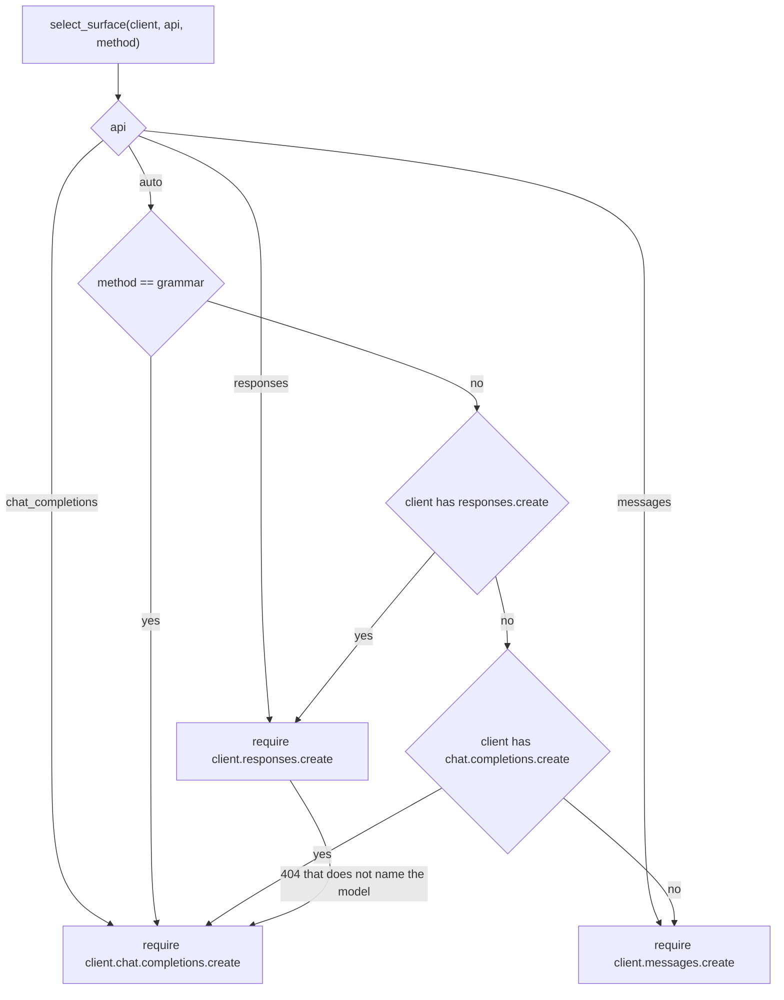

# Methods

*Independent implementation of the documented System One wire format — not affiliated with TypeSafe.*

`method=` picks how the model is asked to decide, and how its answer is turned back into a distribution. The
default, `auto`, picks one of the four concrete methods per client, model and surface — `logprobs` where the
provider returns them, `structured` where it does not (see [auto](#auto)). All four methods share the same
label machinery: options are labelled `A`, `B`, `C`, … in criteria order, and `label_to_key` maps a label back
to the option key (`Choice`), the zero-based level index (`Score`) or `True`/`False` (`Noul`). Switching
methods never changes your question or answer types — only the request body and the readout.

Labels are single letters while a question has 26 options or fewer. Past that they become two letters (`AA`,
`AB`, … `ZZ`), which only `structured` and `discrete` can use: they answer in JSON, where a label is just a
string. `logprobs` and `grammar` read the label *token*, and the first token of `"AA"` is `"A"`, so they raise
`InvalidQuestionError` past 26 options and name the two methods that can take more (up to the Jev API limit of
255).

| Method | Asks for | Distribution comes from |
| --- | --- | --- |
| `logprobs` | one label, plus the logprobs of the alternatives | the model's own next-token distribution |
| `grammar` | one label, constrained by a GBNF grammar | the model's own next-token distribution |
| `structured` | a JSON object with a probability per option | the model's stated numbers, validated and normalized |
| `discrete` | a single option, as JSON | one-hot over the chosen option |

Pick `logprobs` when the provider returns chat logprobs: it is one short call, and the numbers are the model's
real distribution rather than a self-report. Pick `structured` when logprobs are unavailable or the provider
supports strict JSON schema, and `discrete` when you only need the decision and want to skip probabilities.
`grammar` exists for self-hosted Chat Completions servers that accept a `grammar` field. Leaving `method` at
`auto` makes that choice for you, at the cost of one extra provider call per question that runs before the
verdict is known (see [`auto`](#auto) below).

## `auto`

`method="auto"` — the default — answers with `logprobs` where the provider returns them and with `structured`
where it does not, so the same code works against a logprob-capable server, a reasoning model, and a provider
that never implemented logprobs. The choice is made per (model, surface) by observation and remembered for the
life of the client.

Three things count as *this provider cannot do logprobs*:

| Evidence | Response |
| --- | --- |
| The provider rejects the logprob fields with a 4xx that names them — Gemini's OpenAI-compatibility layer answers `Unknown name "logprobs": Cannot find field.`, a reasoning model behind an OpenAI-shaped gateway answers `logprobs are not supported with reasoning models.` | Re-ask the question with `structured`, and remember the verdict |
| The provider refuses the `include` entry a Responses request carries them in — OpenRouter answers `400 Invalid option: expected one of …` for `path: ["include", 0]`, without ever writing the word "logprob" | same |
| The answer carries no logprobs at all (`logprobs: null`, or a compatibility layer that drops the field) | Re-ask the question with `structured`, and remember the verdict once a second response confirms it |
| The answer token's logprobs carry no alternatives — `top_logprobs` empty, or nothing but the sampled token — so there is no distribution to read | same |

A server error (5xx) that survives the transient retries also falls back for that question, because a request
carrying `top_logprobs` is what some OpenAI models fail on; unlike the two rejections above it is *not*
remembered, so one bad minute does not downgrade a working provider.

The last two rows are the weak kind of evidence: a truncated answer, a reasoning-only reply or a provider
hiccup looks exactly like a provider that never implemented logprobs. `auto` therefore answers that question
with `structured` right away but only stops asking for logprobs once a second response says the same thing —
and a readable distribution in between resets the count, because it proves the provider can do it.

Cost and consequences:

- The discovery is paid once per (model, surface) per client — and by every question that is already in
  flight when the first verdict lands. A four-question call at the default `max_concurrency=8` makes four
  logprob attempts, not one; `max_concurrency=1` makes exactly one, because a question that has not started
  yet takes the verdict for free. Every later call goes straight to the resolved method. Under `reasoning`
  each question that probes pays twice, because the analysis pass is re-run for the new method.
- The fallback asks for the model's own probabilities, which are a different quantity from a token
  distribution. `debug["methods"]` says which method each question used, and
  `debug["llm_attempts"][*]["readout"]["source"]` says which one produced a given attempt.
- A `Choice` with more than 26 options is answered in JSON without ever asking for logprobs: one label token
  cannot distinguish `AA` from `A`.
- The verdict lives on the client instance and is keyed by model and surface: a new client, or an explicit
  `method="logprobs"`, starts over. Passing `method` to `system_one` overrides it for that call.
- Only a rejection that refuses the *field* is remembered at once; a response-level absence is remembered on the
  second one (see above). A 4xx that complains about the value it was sent —
  a server whose `top_logprobs` cap is lower than the default answers `Invalid 'top_logprobs': integer must be
  between 0 and 5, but got 20.` — still falls back to `structured` for that question, but nothing is cached:
  the next call tries logprobs again.

Provider support, as of this release — check your provider's docs, since this moves:

| Provider | `logprobs` | Note |
| --- | --- | --- |
| OpenAI `gpt-4o`, `gpt-4.1` | yes | |
| OpenAI reasoning models (`o`-series, `gpt-5` family) | no | `400 logprobs are not supported with reasoning models.` |
| OpenAI Responses surface | partial | `include` alone returns the sampled token and no alternatives; some models fail outright on `top_logprobs >= 2` |
| Anthropic Claude | no | no logprob API at all |
| Gemini via the OpenAI-compatibility endpoint | no | `400 Unknown name "logprobs": Cannot find field.` |
| Gemini native API | yes | not reachable through an OpenAI-compatible client |
| DeepSeek | yes | `top_logprobs` up to 20 |
| Together | yes | send `top_logprobs` for alternatives; `logprobs: 1` alone returns the sampled token |
| llama.cpp | yes | Chat Completions only: its `/v1/responses` shim rejects the logprob fields (`400 top_logprobs requires logprobs to be set to true`), so `auto` re-asks on Chat Completions |
| vLLM | yes | caps `top_logprobs` at its own `--max-logprobs` (20 by default); `/v1/responses` carries them through `include` |
| SGLang | yes | its `/v1/responses` needs `top_logprobs` sent explicitly (it defaults to 0) — jevper always sends it |
| Ollama | partial | local builds since Nov 2025 return logprobs on Chat Completions; its `/v1/responses` returns an empty logprob list, so `auto` re-asks on Chat Completions. Ollama Cloud and older builds report none at all |
| OpenRouter | per model | it routes by price and, by default, sends your request to an endpoint that may ignore `logprobs` — the answer comes back with none, which `auto` reads as "no logprobs" and falls back on. Add `extra_body={"provider": {"require_parameters": True}}` to route only to endpoints that support every field you send. Its Responses API rejects the logprob includable outright (`400 Invalid option: expected one of …` at `path: ["include", 0]`), so `api="auto"` there always resolves to `structured` |
| everything else | unknown | reasoning models and thin compatibility layers are the ones that say no |

With `auto` you do not have to know this table.

## Surface selection



`api="auto"` (the default) prefers the Responses surface because it carries native reasoning and encrypted
content, except for `grammar`, which only Chat Completions can carry. `messages` — the Anthropic-compatible
API — is the last choice of all: no server returns logprobs through it, because the field does not exist in
it, so a client whose only surface is `messages` answers with `structured` and an explicit `logprobs` or
`grammar` raises `UnsupportedMethodError` before any request is sent. A missing attribute raises
`ClientCapabilityError` naming the surface to pass explicitly.

A client object cannot tell you whether the *server* implements the route: `openai.OpenAI` exposes
`responses.create` either way, so a server that does not implement it answers 404 for that call. Under `auto`
that 404 is read as "no Responses surface here" — unless the error names the model, which would fail the same
way on either surface — and the call is re-issued on `chat_completions` and remembered for the rest of the
client's life. An explicit `api="responses"` is a decision, not a preference: its 404 reaches you unchanged.

The remembered verdict only ever *skips* a route, so it moves the call only when the client can speak the
other surface. A client whose only surface is `messages` stays on it, pays the 404 again, and reports it —
the same error the call that learned the verdict raised, rather than an `AttributeError` for an attribute the
client never had.

The preference has one exception, and it is about the readout rather than the surface. A server can implement
the Responses route and still not carry logprobs through it: ollama answers it with an empty logprob list,
llama.cpp refuses the logprob fields there outright (`400 top_logprobs requires logprobs to be set to true`),
and OpenAI's Responses logprobs hold the sampled token with no alternatives. When the label readout cannot
produce a distribution on the chosen surface — for any reason other than a provider failure that survived its
retries — `auto` re-asks on the other surface, marks the one that failed so later calls start where the
distribution is, and keeps that mark for the model. Two things stop the move: `reasoning="native"`, because
native reasoning is the reason to prefer Responses and switching would silently turn it into a two-step pass,
and a server whose other route is missing or already known to be missing. A distribution arriving later on a
marked surface clears the mark: the verdict moves the readout, it does not condemn the surface.

For the four servers this was checked against — what to pass, how to turn thinking off, and what fits a 12 GB
card — see [local-servers.md](local-servers.md).

Request fields per surface:

| | Chat Completions | Responses |
| --- | --- | --- |
| messages | `messages=[...]` | `input=[...]`, plus `store=false` |
| logprobs | `logprobs=true`, `top_logprobs=N` | `top_logprobs=N`, `include=["message.output_text.logprobs"]` |
| JSON schema | `response_format={"type": "json_schema", "json_schema": {"name": ..., "schema": ..., "strict": true}}` | `text={"format": {"type": "json_schema", "name": ..., "schema": ..., "strict": true}}` |
| schema fallback (`structured_outputs=False`) | `response_format={"type": "json_object"}` | `text={"format": {"type": "json_object"}}` |
| grammar | `extra_body={"grammar": "..."}` | not available |
| reasoning | `reasoning_effort` (only when `effort` is set) | `reasoning={effort, summary, context}` |

Neither builder ever sends `max_tokens`, `max_completion_tokens` or `max_output_tokens`: reasoning tokens count
against those caps, and a small cap silently truncates a reasoning model. Cost is bounded by reading only the
first answer token. Any other provider field goes through `extra_body`.

When a server refuses one of the fields above — `400 response_format is not supported`, or the Responses
`text.format`, or `reasoning_effort`, or the `reasoning.encrypted_content` include — jevper treats it the way it
treats a surface that cannot carry logprobs: the field is dropped and the same call is re-asked, one step down
the ladder at a time (`json_schema` → `json_object` → no `response_format` at all, then reasoning, then the
include), and the limit is remembered for the rest of the client's life. None of the three is needed to answer —
the prompt already asks for one JSON object and the readout validates it — so the question is answered instead
of failing. The ladder is finite, so a server that refuses everything still ends in a `ProviderError`, and
`debug["server_limits"]` reports what was learned. A field the caller put in `extra_body` is dropped with it:
the SDK merges `extra_body` last, so leaving it there would re-send the refused field under another name.

A refusal of the *value* is not a refusal of the field, and the difference decides whether the field may be
dropped at all. `budget_tokens: must be at least 1024`, `Invalid 'top_logprobs': integer must be between 0 and
5`, `reasoning_effort must be one of low, medium, high` — each names a field the server knows and a number it
will not take. Dropping the field there would answer the question with the caller's reasoning quietly switched
off, and remember that as the server's limit for a configuration the caller never repeated, so the provider's
own error travels back instead and nothing is cached. Only a complaint about the field's *existence* — `Extra
inputs are not permitted`, `is not supported`, `Cannot find field` — moves the ladder.

## `logprobs`

Request: the label prompt plus `logprobs=true` and `top_logprobs` (default 20, the provider maximum; `0` is
allowed). On the Responses surface the logprobs arrive through `include=["message.output_text.logprobs"]`.

Readout:

1. The first non-whitespace token of the answer must be a label (compared case-insensitively). A reasoning
   server reports logprobs for every generated token — vLLM, SGLang and ollama include the thinking span while
   `message.content` holds only the answer — so the answer's own tokens are located first, by matching the
   answer text against the tail of the token stream. The match is strict: without a separated trace, or without
   an exact tail, nothing is skipped and the stream is read as it arrives, so a mismatch is an error rather
   than a guess. Disabling thinking is still the better deployment — a one-token answer does not need a
   reasoning pass.
2. Its logprob is taken from the token itself, and the rest of the distribution from the token's
   `top_logprobs` entries. A label the provider did not report gets probability exactly `0.0` and is listed in
   `debug["labels_missing"]`. A provider that reports `logprob: null` — some OpenAI-compatible servers do — is
   treated the same way: no number is invented, so a missing alternative is `0.0` and a missing logprob *for
   the answer token* raises `LabelReadoutError` instead of reading as certainty.
3. The logprobs are softmaxed over the labels only. A grammar masks logits but never renormalizes them, so
   renormalizing over the label set gives the post-mask distribution — which is why `grammar` reuses this
   readout unchanged.

For criteria `{"billing", "technical", "sales"}` and logprobs `A:-0.12, B:-2.47, C:-3.48`, the answer is
`billing` with `{"billing": 0.884873983, "technical": 0.084389690, "sales": 0.030736327}` and
`confidence = 0.827310974`.

Caveats:

- `top_logprobs=0` reports nothing but the answer token, and one logprob is not a distribution: the readout
  raises rather than reporting certainty, and `auto` falls back to `structured` instead. Raise `top_logprobs`
  (20 covers 21 options) to get a real distribution.
- A truncated `top_logprobs` list silently zeroes the missing options; check `debug["labels_missing"]` when
  that matters.
- The distribution is the model's preference over the *next token*, so the prompt must leave the label as the
  only sensible continuation — that is what the system prompt and the `Options:` block are for.
- OpenAI reports `-9999.0` for tokens outside the top 20 rather than omitting them; that underflows to `0.0`
  like any other very low logprob, so it needs no special handling.
- Option descriptions and instructions are rendered verbatim into the options block. A description containing a
  newline followed by a label-shaped line (`B: something`) injects a pseudo-option into the prompt; the readout
  only accepts the allocated labels, so the result is a `LabelReadoutError` and one corrective retry, but keep
  descriptions single-line and free of label-like lines.

Failure modes, all raising `LabelReadoutError` or a subclass:

- **No distribution at all**: no logprobs came back (`no logprobs returned for the answer token
  (method='logprobs')`), or the answer token's `top_logprobs` held nothing but the sampled token. The message
  names `structured` and `discrete`, and no corrective retry is spent — re-asking with a correction turn
  cannot make a provider report logprobs it does not have. `auto` answers these with `structured` instead of
  raising.
- **Unusable answer**: no non-whitespace token, or a first token that is not a label (`first non-whitespace
  token 'The' is not one of the labels [...]`). These *are* retried once with a correction message: the model,
  not the provider, is at fault.
- **Unusable number**: no logprob for the answer token, or a non-finite logprob (`nan`/`inf`) from the
  provider — a `nan` distribution would otherwise poison `confidence` and `score`.

## `grammar`

Request: identical to `logprobs`, plus a GBNF grammar for the labels, e.g. for three options:

```
root ::= "A" | "B" | "C"
```

The grammar is merged into `extra_body` as `{"grammar": "..."}`, the field llama.cpp's OpenAI-compatible server
reads on `/v1/chat/completions`. Readout is the `logprobs` readout, unchanged.

Constraints:

- Chat Completions only. `grammar` with `api="responses"` raises `UnsupportedMethodError` before any request is
  sent:

  ```
  grammar requires a Chat Completions surface that accepts a `grammar` field (llama-cpp-python and
  similar servers); pass api='chat_completions'
  ```
- The server must still return logprobs; if it does not, the readout raises `LabelReadoutError` suggesting
  `method="discrete"`, which skips probabilities, and no corrective retry is spent — another turn cannot change
  what the provider reports.
- Most hosted providers reject or ignore an unknown `grammar` field, so this is a self-hosted-server method.

## `structured`

Request: a strict JSON schema, with the model reporting a probability per option. Schema names are
`jevper_choice`, `jevper_noul` and `jevper_score`; every object sets `additionalProperties: false` and lists
all properties in `required`. The schemas carry no numeric bounds: strict mode does accept `minimum`/`maximum`
(though not for fine-tuned models), but the constraint that matters here — the distribution summing to 1 — is
not expressible in JSON Schema, so range checks are client-side either way.

```json
{"type": "object",
 "properties": {"probabilities": {"type": "object",
     "properties": {"billing": {"type": "number"}, "technical": {"type": "number"}, "sales": {"type": "number"}},
     "required": ["billing", "technical", "sales"], "additionalProperties": false}},
 "required": ["probabilities"], "additionalProperties": false}
```

`noul` uses `{"noul": {"type": "number"}}` (the probability of `true`); `score` uses the level indexes
`"0"`, `"1"`, … as keys.

Readout:

1. Parse the answer as JSON: `json.loads`, falling back to decoding from the first `{` when the model wrapped
   the object in prose or fences. A non-object raises `MalformedAnswerError`.
2. `choice` requires exactly the option keys, each a finite number `>= 0`; `noul` requires `noul` in `[0, 1]`
   and expands to `{True: v, False: 1 − v}`; `score` requires exactly the level keys. Missing or extra keys,
   booleans, `NaN` and negatives are malformed.
3. Normalization (not part of the readout): when `abs(sum − 1) > 1e-6` and `normalize_probabilities=True` (the
   default), the distribution is rescaled to sum 1 and both the error and the model's original numbers are
   recorded in `debug["probability_errors"]` and `debug["original_probabilities"]`. A zero total becomes
   uniform. Values whose sum leaves the float range — a model that answers `1e308` three times — are scaled by
   their largest value first, so normalization cannot raise `OverflowError`. With
   `normalize_probabilities=False` the model's numbers are returned verbatim and only the error
   is recorded — never raised, matching the reference adapter.
4. `choice` is the argmax of the final distribution, and `confidence` is computed from it.

`structured_outputs=False` keeps the schema in the prompt but sends `{"type": "json_object"}` instead of a
strict schema — the documented workaround when a provider rejects `response_format`. It is also automatic: a
server that refuses the strict schema is re-asked once with `json_object`, and a server that refuses that too is
answered with the schema in the prompt alone (see the request table above). The answer is still validated
client-side, so an unusable shape raises `MalformedAnswerError` after the corrective retry.

`temperature=0.0` is worth setting here (and for `discrete`): the answer is a single sampled JSON object, so
sampling noise moves the probabilities directly.

## `discrete`

Request: a strict JSON schema asking for one option and nothing else.

| Question | Schema (`jevper_choice` / `jevper_noul` / `jevper_score`) |
| --- | --- |
| `choice` | `{"choice": {"type": "string", "enum": ["A", "B", "C"]}}` |
| `noul` | `{"noul": {"type": "boolean"}}` |
| `score` | `{"score": {"type": "integer", "enum": [0, 1, 2]}}` |

Readout: one-hot over the chosen option. `choice` accepts a label (`"B"`, case-insensitive) or a criteria key
(`"billing"`); an exact criteria key wins over a label spelled the same way, so an option keyed `"a"` is read as
that option and not as the first label. `noul` requires a JSON boolean or its string form (`"true"`/`"false"`);
`score` requires a level index — an integer, an integral float such as `2.0`, or a number in a string such as
`"2"`. The string forms are what models tend to emit when the schema is only in the prompt
(`structured_outputs=False`). A bool is rejected as a score, since `true` would otherwise read as level 1.
Anything else raises `MalformedAnswerError`.

Because the readout parses a JSON object, the system prompt, the few-shot demonstrations and the two-step answer
cue all ask for that JSON object rather than for a bare label.

The resulting `confidence` is `1.0` for `choice` and `score` — all the mass sits on one option, which is
maximal confidence under both formulas. `noul` answers carry no confidence.

## Reading failures

`LabelReadoutError` and `MalformedAnswerError` are recoverable: the client appends a correction turn — for
labels, `Your previous reply was invalid: {reason}. Reply with exactly one of these labels and nothing else:
A, B, C.`; for JSON, `Your previous reply was invalid: {reason}. Return only a JSON object matching the
schema.` — and re-issues the answer call up to `n_retry_malformed` times (default 1). Reasons are recorded in
`debug["retry_reasons"]`, and each retry is a provider call, so it counts towards `usage.n_calls`.

A `LabelReadoutError` that says the provider cannot report logprobs — no logprobs at all, or no alternatives
for the answer token — is not corrected, because another turn cannot change what the provider returns;
`method="auto"` answers those questions with `structured` instead.

When there is no answer to read at all, the message says why, because the parse error alone sends a caller
looking for a bug that is not there:

- **The output budget ran out.** Each surface has its own word for it — Chat Completions `finish_reason:
  "length"`, the Messages API `stop_reason: "max_tokens"` or `"model_context_window_exceeded"`, the Responses
  surface `status: "incomplete"` with `incomplete_details.reason: "max_output_tokens"` — and all of them reach
  the caller as *the provider ran out of output tokens before the answer was complete*, with the field to raise.
  This holds however the answer was cut off: mid-object, or with no `{` at all.
- **The model refused.** OpenAI reports a safety refusal in a `refusal` sibling of a null `content`, and the
  Messages API as `stop_reason: "refusal"`. The message carries the model's own words, so a refusal reads as a
  refusal rather than as malformed JSON.
- **The server separated reasoning from the answer and sent no answer.** A reasoning parser with thinking on
  does this (see [`local-servers.md`](local-servers.md)), and the message says so instead of "no non-whitespace
  token in the response".
