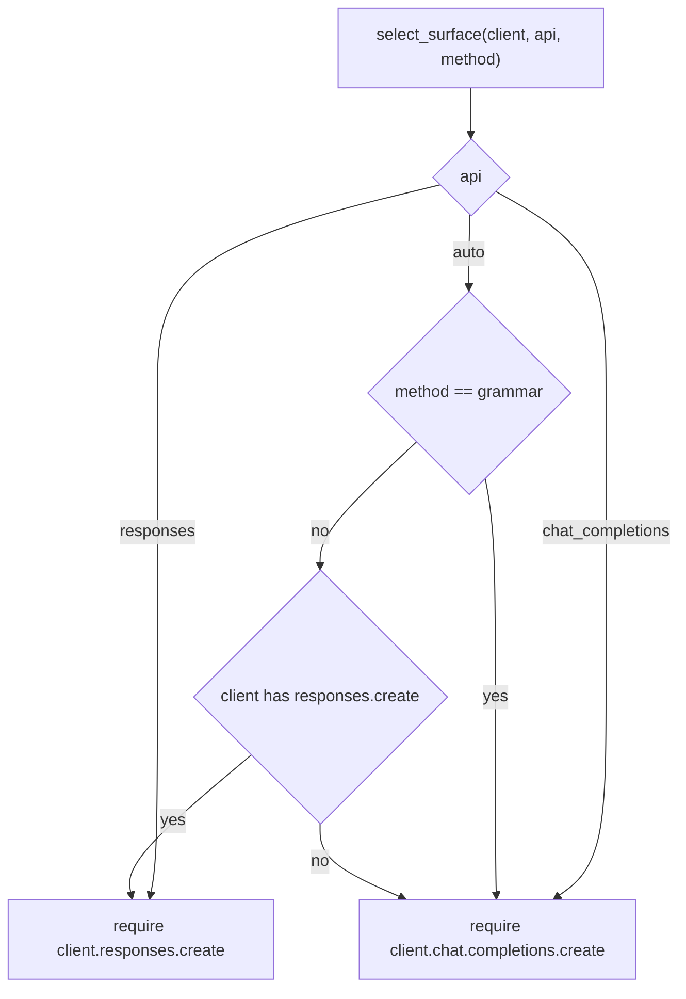

# Methods

*Independent implementation of the documented System One wire format — not affiliated with TypeSafe.*

`method=` picks how the model is asked to decide, and how its answer is turned back into a distribution. All
four methods share the same label machinery: options are labelled `A`, `B`, `C`, … in criteria order, and
`label_to_key` maps a label back to the option key (`Choice`), the zero-based level index (`Score`) or `True`/
`False` (`Noul`). Switching methods never changes your question or answer types — only the request body and the
readout.

| Method | Asks for | Distribution comes from |
| --- | --- | --- |
| `logprobs` | one label, plus the logprobs of the alternatives | the model's own next-token distribution |
| `grammar` | one label, constrained by a GBNF grammar | the model's own next-token distribution |
| `structured` | a JSON object with a probability per option | the model's stated numbers, validated and normalized |
| `discrete` | a single option, as JSON | one-hot over the chosen option |

Pick `logprobs` when the provider returns chat logprobs: it is one short call, and the numbers are the model's
real distribution rather than a self-report. Pick `structured` when logprobs are unavailable or the provider
supports strict JSON schema, and `discrete` when you only need the decision and want to skip probabilities.
`grammar` exists for self-hosted Chat Completions servers that accept a `grammar` field.

## Surface selection



`api="auto"` (the default) prefers the Responses surface because it carries native reasoning and encrypted
content, except for `grammar`, which only Chat Completions can carry. A missing attribute raises
`ClientCapabilityError` naming the surface to pass explicitly.

Request fields per surface:

| | Chat Completions | Responses |
| --- | --- | --- |
| messages | `messages=[...]` | `input=[...]`, plus `store=false` |
| logprobs | `logprobs=true`, `top_logprobs=N` | `top_logprobs=N`, `include=["message.output_text.logprobs"]` |
| JSON schema | `response_format={"type": "json_schema", "json_schema": {"name": ..., "schema": ..., "strict": true}}` | `text={"format": {"type": "json_schema", "name": ..., "schema": ..., "strict": true}}` |
| schema fallback (`structured_outputs=False`) | `response_format={"type": "json_object"}` | `text={"format": {"type": "json_object"}}` |
| grammar | `extra_body={"grammar": "..."}` | not available |
| reasoning | `reasoning_effort` (only when `effort` is set) | `reasoning={effort, summary, context}` |
| stop sequences | `stop` | never sent — the surface has no equivalent field |

Neither builder ever sends `max_tokens`, `max_completion_tokens` or `max_output_tokens`: reasoning tokens count
against those caps, and a small cap silently truncates a reasoning model. Cost is bounded by reading only the
first answer token.

## `logprobs`

Request: the label prompt plus `logprobs=true` and `top_logprobs` (default 20, the provider maximum; `0` is
allowed). On the Responses surface the logprobs arrive through `include=["message.output_text.logprobs"]`.

Readout:

1. The first non-whitespace token of the answer must be a label (compared case-insensitively).
2. Its logprob is taken from the token itself, and the rest of the distribution from the token's
   `top_logprobs` entries. A label the provider did not report gets probability exactly `0.0` and is listed in
   `debug["labels_missing"]`.
3. The logprobs are softmaxed over the labels only. A grammar masks logits but never renormalizes them, so
   renormalizing over the label set gives the post-mask distribution — which is why `grammar` reuses this
   readout unchanged.

For criteria `{"billing", "technical", "sales"}` and logprobs `A:-0.12, B:-2.47, C:-3.48`, the answer is
`billing` with `{"billing": 0.884873983, "technical": 0.084389690, "sales": 0.030736327}` and
`confidence = 0.827310974`.

Caveats:

- With `top_logprobs=0` only the answer token is reported, so its probability becomes `1.0` and every other
  option `0.0`. Raise `top_logprobs` (20 covers 21 options) to get a real distribution.
- A truncated `top_logprobs` list silently zeroes the missing options; check `debug["labels_missing"]` when
  that matters.
- The distribution is the model's preference over the *next token*, so the prompt must leave the label as the
  only sensible continuation — that is what the system prompt and the `Options:` block are for.

Failure modes, each raising `LabelReadoutError`: no logprobs at all (`no logprobs returned for the answer
token (method='logprobs')`), no non-whitespace token, or a first token that is not a label (`first
non-whitespace token 'The' is not one of the labels [...]`). The client retries once with a correction message
before giving up.

## `grammar`

Request: identical to `logprobs`, plus a GBNF grammar for the labels, e.g. for three options:

```
root ::= "A" | "B" | "C"
```

The grammar is merged into `extra_body` as `{"grammar": "..."}`, the field llama.cpp's OpenAI-compatible server
reads on `/v1/chat/completions`. Readout is the `logprobs` readout, unchanged.

Constraints:

- Chat Completions only. `grammar` with `api="responses"` raises `UnsupportedMethodError` before any request is
  sent:

  ```
  grammar requires a Chat Completions surface that accepts a `grammar` field (llama-cpp-python and
  similar servers); pass api='chat_completions'
  ```
- The server must still return logprobs; if it does not, the readout raises `LabelReadoutError` suggesting
  `method="discrete"`, which skips probabilities.
- Most hosted providers reject or ignore an unknown `grammar` field, so this is a self-hosted-server method.

## `structured`

Request: a strict JSON schema, with the model reporting a probability per option. Schema names are
`jevper_choice`, `jevper_noul` and `jevper_score`; every object sets `additionalProperties: false` and lists
all properties in `required`, and no numeric `minimum`/`maximum` is used (strict mode rejects them, so range
checks are client-side).

```json
{"type": "object",
 "properties": {"probabilities": {"type": "object",
     "properties": {"billing": {"type": "number"}, "technical": {"type": "number"}, "sales": {"type": "number"}},
     "required": ["billing", "technical", "sales"], "additionalProperties": false}},
 "required": ["probabilities"], "additionalProperties": false}
```

`noul` uses `{"noul": {"type": "number"}}` (the probability of `true`); `score` uses the level indexes
`"0"`, `"1"`, … as keys.

Readout:

1. Parse the answer as JSON: `json.loads`, falling back to decoding from the first `{` when the model wrapped
   the object in prose or fences. A non-object raises `MalformedAnswerError`.
2. `choice` requires exactly the option keys, each a finite number `>= 0`; `noul` requires `noul` in `[0, 1]`
   and expands to `{True: v, False: 1 − v}`; `score` requires exactly the level keys. Missing or extra keys,
   booleans, `NaN` and negatives are malformed.
3. Normalization (not part of the readout): when `abs(sum − 1) > 1e-6` and `normalize_probabilities=True` (the
   default), the distribution is rescaled to sum 1 and both the error and the model's original numbers are
   recorded in `debug["probability_errors"]` and `debug["original_probabilities"]`. A zero total becomes
   uniform. With `normalize_probabilities=False` the model's numbers are returned verbatim and only the error
   is recorded — never raised, matching the reference adapter.
4. `choice` is the argmax of the final distribution, and `confidence` is computed from it.

`structured_outputs=False` keeps the schema in the prompt but sends `{"type": "json_object"}` instead of a
strict schema — the documented workaround when a provider rejects `response_format`. The answer is still
validated client-side, so an unusable shape raises `MalformedAnswerError` after the corrective retry.

`temperature=0.0` is worth setting here (and for `discrete`): the answer is a single sampled JSON object, so
sampling noise moves the probabilities directly.

## `discrete`

Request: a strict JSON schema asking for one option and nothing else.

| Question | Schema (`jevper_choice` / `jevper_noul` / `jevper_score`) |
| --- | --- |
| `choice` | `{"choice": {"type": "string", "enum": ["A", "B", "C"]}}` |
| `noul` | `{"noul": {"type": "boolean"}}` |
| `score` | `{"score": {"type": "integer", "enum": [0, 1, 2]}}` |

Readout: one-hot over the chosen option. `choice` accepts a label (`"B"`, case-insensitive) or a criteria key
(`"billing"`); `noul` requires a JSON boolean; `score` requires an integer level index (a bool is rejected,
since `true` would otherwise read as level 1). Anything else raises `MalformedAnswerError`.

The resulting `confidence` is `1.0` for `choice` and `score` — all the mass sits on one option, which is
maximal confidence under both formulas. `noul` answers carry no confidence.

## Reading failures

`LabelReadoutError` and `MalformedAnswerError` are recoverable: the client appends a correction turn — for
labels, `Your previous reply was invalid: {reason}. Reply with exactly one of these labels and nothing else:
A, B, C.`; for JSON, `Your previous reply was invalid: {reason}. Return only a JSON object matching the
schema.` — and re-issues the answer call up to `n_retry_malformed` times (default 1). Reasons are recorded in
`debug["retry_reasons"]`, and each retry is a provider call, so it counts towards `usage.n_calls`.
