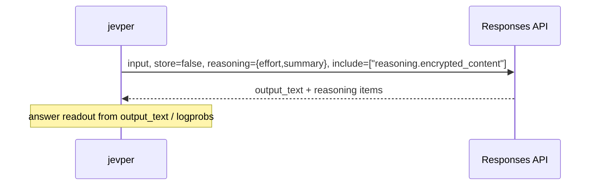
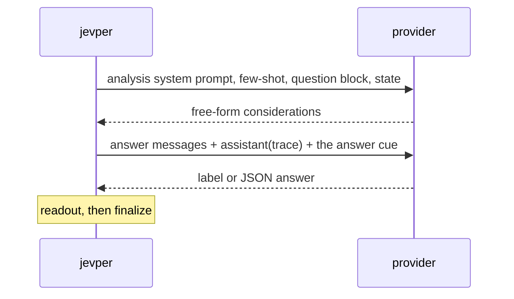

# Reasoning

*Independent implementation of the documented System One wire format — not affiliated with TypeSafe.*

`reasoning=ReasoningConfig(...)` asks the model to think before it commits to an answer. There are two ways to
get that, and the config's `mode` decides which one is used.

```python
ReasoningConfig(effort="medium", summary="auto", mode="auto")
```

- `effort` — `none`, `minimal`, `low`, `medium`, `high`, `xhigh`, `max`
- `summary` — `auto`, `concise`, `detailed`
- `context` — `auto`, `current_turn`, `all_turns`
- `mode` — `auto`, `native`, `two_step`
- `budget_tokens` — the thinking budget for the Messages surface's `thinking` field; unset sends no
  `thinking` at all, and `effort` is never translated into a budget, because the mapping between a name and
  a token count is the caller's. Anthropic requires at least 1024 and strictly less than `max_tokens`

## Mode resolution

| `mode` | Responses surface | Chat Completions surface | Messages surface |
| --- | --- | --- | --- |
| `auto` (default) | `native` | `two_step` | `two_step` |
| `native` | provider reasoning on the answer call | `reasoning_effort` on the answer call | `thinking` on the answer call, when `budget_tokens` is set |
| `two_step` | analysis call, then answer call | analysis call, then answer call | analysis call, then answer call |
| reasoning not configured | off | off | off |

`response.debug["reasoning_mode"]` reports what was actually used.

## Native

One provider call, with the reasoning parameters attached. The provider's reasoning items are copied into
`response.reasoning` unchanged.



On the Responses surface the request carries `reasoning={"effort": ..., "summary": ..., "context": ...}`
(only the fields you set), `store=false`, and `include` gains `reasoning.encrypted_content` so the reasoning
items can be replayed later. On Chat Completions only `reasoning_effort` is sent, and only when `effort` is
set — `summary` and `context` have no chat equivalent.

Reasoning text is picked up from the provider's own fields: `reasoning_content`, else `thinking`, else
`reasoning` (as a string or as reasoning parts), else reasoning parts inside a list-shaped `message.content`.
A string becomes a `ReasoningTextPart` inside a `ReasoningContentPart`, so `reasoning_text()` works the same
across providers.

## Two-step

Two calls per question: an analysis pass, then the answer pass with the analysis replayed as an assistant
turn.



- The analysis call sends no schema and no logprobs: it is plain text, so the model reasons freely. It is also
  where few-shot turns appear, exactly as in the answer call.
- The answer call reuses the full message list, appends `{"role": "assistant", "content": trace}` and then the
  answer cue: `{"role": "user", "content": "Now reply with the label only."}` for `logprobs`/`grammar`, and
  `"Now reply with the JSON object only."` for `structured`/`discrete`, whose answers are JSON. Corrective
  retries append after that cue.
- An analysis pass that returns no text — a reasoning model that thinks without writing output — is handled
  without sending an empty assistant turn, which several OpenAI-compatible servers reject. If the call did
  return reasoning, that reasoning text becomes the trace for the answer call; if it returned neither, the
  answer call runs straight from the question block to the cue.
- The trace is `response.reasoning[0]` — a `ReasoningContentPart` whose summary text is the analysis output —
  followed by any native reasoning items the two calls returned, so `reasoning_text(response.reasoning)`
  returns the trace. When the analysis produced no text of its own, no synthetic part is added and the
  provider's own item is the trace, so the text is not duplicated.
- Both calls count towards `usage`: `n_calls` is 2 per question (plus corrective retries), and both calls'
  tokens are summed. Two-step reasoning is therefore roughly twice the cost of a plain call.

One asymmetry to know about: the analysis call only receives reasoning parameters when the surface is the
Responses API. On Chat Completions a two-step call sends no `reasoning_effort` at all — the analysis prompt
*is* the reasoning step. If you want the provider's own reasoning on the chat surface, use
`mode="native"`.

## Models that always think

Some templates cannot turn thinking off — the Qwen3 2507 *Thinking* releases are the example: their chat
template primes the assistant turn with ` thinking` and exposes no toggle, so a request that asks for no
reasoning still gets a reasoning span. That costs the label readout. `logprobs` and `grammar` read the first
non-whitespace token of the *answer*, and a model that thinks first and then answers in prose raises
`LabelReadoutError` carrying whatever it wrote — `Okay`, on `Qwen3-4B-Thinking-2507` served by ollama.
`structured` and `discrete` are unaffected: they parse the JSON object out of the answer text, wherever the
reasoning went. Use one of those for an always-thinking model, or a model that can be asked not to think.

## Reading the trace

```python
from jevper import reasoning_text

reasoning_text(response.reasoning)   # joined summary texts, else joined content texts, else ""
```

`ReasoningContentPart` keeps unknown fields (`id`, `status`, `encrypted_content`, …) so Responses items can be
replayed into a later request without loss. `reasoning_text` prefers summaries over content texts, and joins
multiple parts with a blank line.

Replaying a trace yourself is a matter of feeding the parts back into the next call's input; `store=false`
means the provider keeps no state for you, and `encrypted_content` is what makes the reasoning items portable.
