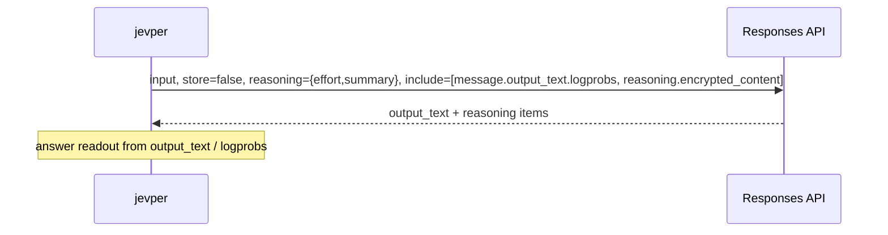

# Reasoning

*Independent implementation of the documented System One wire format — not affiliated with TypeSafe.*

`reasoning=ReasoningConfig(...)` selects jevper's native or two-step reasoning path. Whether the provider
receives a reasoning parameter depends on the fields applicable to the selected surface and the model.

```python
ReasoningConfig(effort="medium", summary="auto", mode="auto")
```

- `effort` — `none`, `minimal`, `low`, `medium`, `high`, `xhigh`, `max`
- `summary` — `auto`, `concise`, `detailed`
- `context` — `auto`, `current_turn`, `all_turns`
- `mode` — `auto`, `native`, `two_step`
- `budget_tokens` — the manual thinking budget for the Messages surface's `thinking` field; with neither
  this field nor caller-supplied `extra_body["thinking"]`, jevper sends no `thinking` block, and `effort`
  is never translated into a budget. Claude 4.6 deprecated manual budgets, and Claude 4.7 and later reject
  them with `400`; for 4.6 and newer, Anthropic's supported path is
  `thinking={"type": "adaptive"}` (optionally with `display: "summarized"`) and
  `output_config={"effort": ...}`, while 4.5 and earlier use the manual form. Callers can pass those
  fields through `extra_body`; jevper does not construct them.
  Where the manual form applies, Anthropic requires at least 1024 and a budget strictly below
  `max_tokens`. The `interleaved-thinking-2025-05-14` beta on the Messages API with tools permits the
  budget to exceed `max_tokens`, but jevper does not use that exception and refuses locally.
  When native mode sends a `ReasoningConfig` budget, jevper grows the Messages `max_tokens` default to
  `1024 + budget_tokens`; explicit `mode="two_step"` supplies no config `thinking` and leaves jevper's
  default at `1024`. A caller-supplied manual thinking budget is sized the same way;
  `extra_body={"max_tokens": n}` still wins, but `n` must be greater than the sent budget.
  A server that refuses the budget *value* — SGLang answers `budget_tokens: must be at least 1024` — gets
  its own error back rather than a silent re-ask without thinking, because a bad number is not a missing
  field. A field-capability refusal — evidence naming `reasoning`, `thinking`, or `budget_tokens` but none
  of jevper's value markers — drops the field, re-asks, and remembers the limit for that model and
  surface.

## Mode resolution

| `mode` | Responses surface | Chat Completions surface | Messages surface |
| --- | --- | --- | --- |
| `auto` (default) | `native` | `two_step` | `two_step`, or `native` when `budget_tokens` is set |
| `native` | answer call; non-null effort/summary/context form `reasoning` | answer call; effort becomes `reasoning_effort` | answer call; budget becomes `thinking` |
| `two_step` | analysis call, then answer call | analysis call, then answer call | analysis call, then answer call |
| reasoning not configured | off | off | off |

`response.debug["reasoning_mode"]` is the mode for the surface on which the call ended. When questions used
more than one surface, `response.debug["reasoning_modes"]` maps each question id to the mode derived from
that question's own last attempt.

On the Messages surface a budget resolves `auto` to `native`, because a budget is the only reason to ask
for that surface's own thinking. `two_step` supplies no reasoning config to either call, so it sends no
`thinking` from `ReasoningConfig`; a caller-supplied `extra_body["thinking"]` remains authoritative. On Chat
Completions `auto` stays `two_step` — `reasoning_effort` there is a separate decision, and the surface has
no thinking budget to infer one from.

## Native

Native uses the answer call rather than a separate analysis call. jevper attaches whichever applicable
reasoning fields are set — none when the config has no field for that surface — and corrective or
capability retries can add provider calls. Readable provider reasoning is normalized into
`ReasoningContentPart`; Responses and Messages extra fields are retained, nonstandard part types are
canonicalized, and unreadable parts are skipped.



By default, Responses sends the non-null config fields as
`reasoning={"effort": ..., "summary": ..., "context": ...}`; an `extra_body["reasoning"]` value replaces
that typed object. Unless overridden in `extra_body`, Responses sends `store=false`; unless `include` is
overridden or the server has refused the include field, jevper adds `reasoning.encrypted_content` and,
for a logprobs readout, `message.output_text.logprobs`. Chat Completions sends jevper's
`reasoning_effort` only when `effort` is set; an `extra_body` key wins and can send it when the config
does not, while `summary` and `context` have no Chat equivalent. From `ReasoningConfig`, Messages supplies
`thinking` only for `budget_tokens` and only until that field is refused; `effort` is not translated.
Caller-supplied `extra_body["thinking"]` is authoritative.

On Claude Fable 5.1, Mythos 5.1, Fable 5, Mythos 5, Mythos Preview, Opus 5.5, Opus 5, Opus 4.8, Opus 4.7,
and Sonnet 5, Anthropic rejects a non-default `temperature`, `top_p`, or `top_k` on every Messages request,
whether thinking is on or off. On older models those restrictions apply only while thinking is on:
`temperature` and `top_k` are incompatible, and `top_p` is allowed only from 0.95 through 1. The
`anthropic` 1.8 SDK removed all three from `messages.create()`, so jevper sends its `temperature` option
through `extra_body` when it is configured and no thinking budget is sent; caller sampling fields remain
authoritative.

Chat Completions reads `reasoning_content`, then `thinking`, then `reasoning`, then reasoning parts in a
list-shaped `message.content`; a string becomes a `ReasoningTextPart`. Responses reads reasoning items
from `output`, while Messages reads thinking content blocks.

## Two-step

The base path uses two provider calls per question: an analysis pass, then the answer pass with the analysis
replayed as an assistant turn.


- jevper adds no schema and no logprobs to the analysis call: it is plain text, so the model reasons
  freely. Caller-supplied `extra_body` fields are still forwarded, and few-shot turns appear exactly as in
  the answer call.
- The answer call reuses the full message list, appends `{"role": "assistant", "content": trace}` and then the
  answer cue: `{"role": "user", "content": "Now reply with the label only."}` for `logprobs`/`grammar`, and
  `"Now reply with the JSON object only."` for `structured`/`discrete`, whose answers are JSON. Corrective
  retries append after that cue.
- An analysis pass that returns no text — a reasoning model that thinks without writing output — is handled
  without sending an empty assistant turn, which several OpenAI-compatible servers reject. If the call did
  return reasoning, that reasoning text becomes the trace for the answer call; if it returned neither, the
  answer call runs straight from the question block to the cue.
- For a one-question two-step response with analysis text, `response.reasoning[0].summary[0].text` is the
  synthetic analysis trace. A multi-question response flattens all questions' reasoning in question
  order, so only the first question's trace occupies index 0. `reasoning_text(response.reasoning)` returns
  the trace plus any native summary texts because summaries take precedence over content texts. When the
  analysis produced no text of its own, no synthetic part is added and the provider's own item is the
  trace, so the text is not duplicated.
- The base two-step path uses two provider calls and sums their reported token counts; `n_calls` also
  includes capability and corrective retries. Monetary cost depends on the provider, model, generated
  tokens, and cache reuse.

jevper supplies reasoning config to the analysis call only on the Responses API. On Chat Completions it
sends no typed `reasoning_effort` on that call — the analysis prompt *is* the reasoning step — although a
caller-supplied `extra_body["reasoning_effort"]` is forwarded. If you want the provider's own reasoning on
the Chat surface, use `mode="native"`.

## Models that always think

Some templates cannot turn thinking off — the Qwen3 2507 *Thinking* releases are the example: their chat
template primes the assistant turn with ` thinking` and exposes no toggle, so a request that asks for no
reasoning still gets a reasoning span. That costs the label readout. `logprobs` and `grammar` read the first
non-whitespace token of the *answer*, and a model that thinks first and then answers in prose raises
`LabelReadoutError` carrying whatever it wrote — `Okay`, on `Qwen3-4B-Thinking-2507` served by ollama.
`structured` and `discrete` are unaffected: they parse the JSON object out of the answer text, wherever the
reasoning went. Use one of those for an always-thinking model, or a model that can be asked not to think.

## Reading the trace

```python
from jevper import reasoning_text

reasoning_text(response.reasoning)   # joined summary texts, else joined content texts, else ""
```

`ReasoningContentPart` keeps unknown fields (`id`, `status`, `encrypted_content`, …) so Responses items can be
replayed into a later request without loss. `reasoning_text` prefers summaries over content texts, and joins
multiple parts with a blank line.

Responses reasoning items can be dumped and replayed as later Responses input; `store=false` means the
provider keeps no state for you, and `encrypted_content` makes the reasoning items portable. Messages
thinking blocks are normalized for reading, so replaying one requires converting it back to Anthropic's
original `{"type": "thinking", "thinking": ..., "signature": ...}` shape and preserving the block unchanged.
